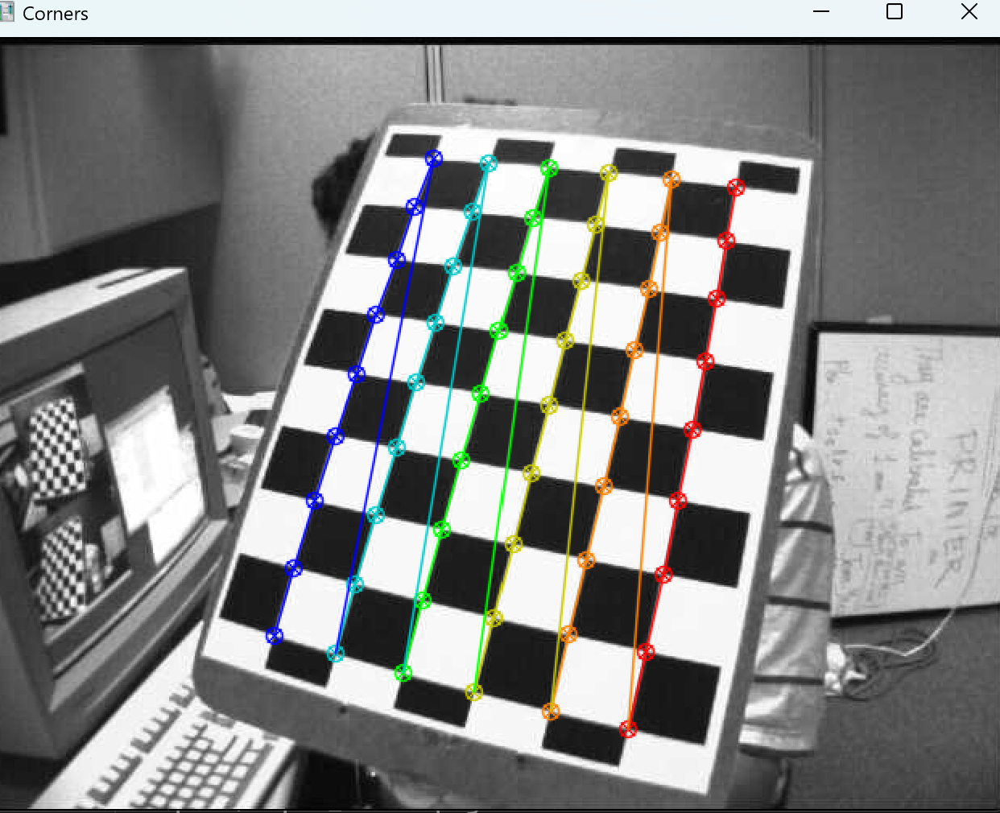
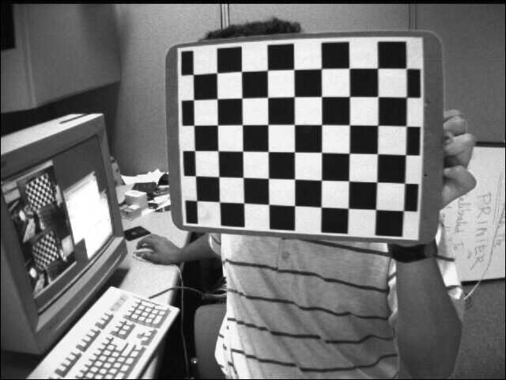
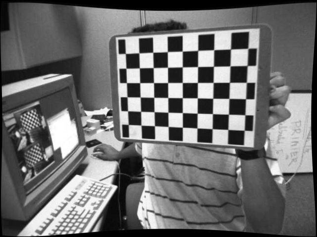
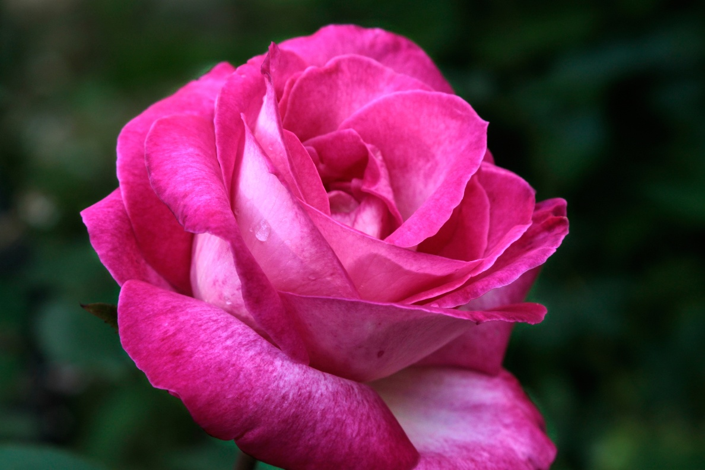
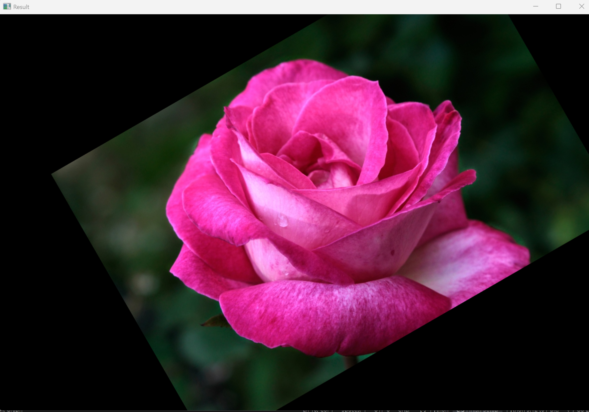
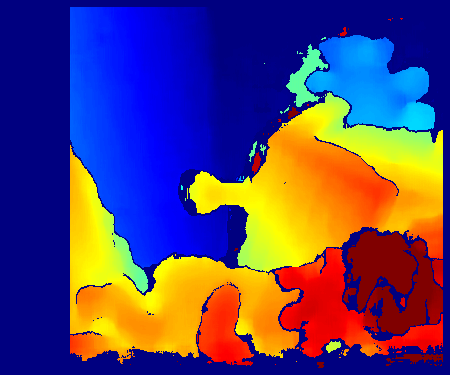
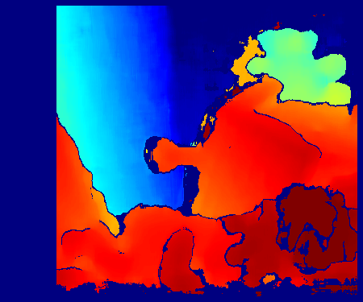
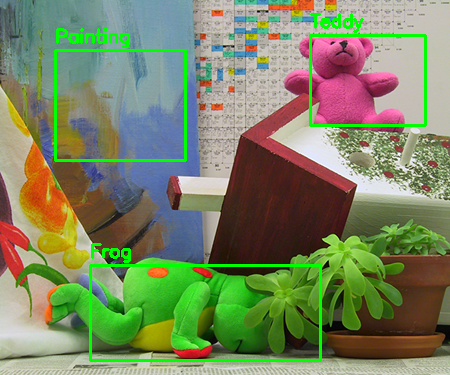

# Computer Vision Week 2 Assignment

OpenCV와 Python을 이용한 **중급 컴퓨터 비전 과제**입니다.  
이번 실습에서는 **Camera Calibration, Affine Transformation, Stereo Depth Estimation**을 구현했습니다.

---

# Development Environment

* Python 3.11.8
* OpenCV (cv2)
* NumPy
* OS : Windows 10

---

# Project Structure

```
computervision
│
├── 1week
│
├── 2week
│   ├── ex1_calibrate.py
│   ├── ex2_rotatetransform.py
│   ├── ex3_disparity.py
│   │
│   ├── calibration_images
│   │
│   ├── rose.png
│   ├── rotatetransformrose.png
│   ├── left.png
│   ├── right.png
│   ├── undistorted_result.png
│   ├── ex3_totalresult.png
│   │
│   ├── outputs
│   │   ├── disparity_color.png
│   │   ├── depth_color.png
│   │   ├── left_roi.png
│   │   └── right_roi.png
│   │
│   └── README.md
│
└── README.md
```

---

# Assignment 1 : Camera Calibration

## Description

체커보드 이미지를 이용하여 **카메라 캘리브레이션(Camera Calibration)** 을 수행한다.

카메라 캘리브레이션은 다음 정보를 계산하기 위해 사용된다.

* Camera Matrix (카메라 내부 파라미터)
* Distortion Coefficients (렌즈 왜곡 계수)
* Reprojection Error (캘리브레이션 정확도)

이를 통해 **렌즈 왜곡이 제거된 이미지**를 생성할 수 있다.

---

## Key Function

```
cv.findChessboardCorners()
cv.cornerSubPix()
cv.calibrateCamera()
cv.projectPoints()
cv.undistort()
```

---

## Code Explanation

### 1. 체커보드 설정

```
CHECKERBOARD = (9,6)
square_size = 25
```

| 변수 | 설명 |
|-----|------|
| CHECKERBOARD | 체커보드 내부 코너 개수 |
| square_size | 체커보드 한 칸의 실제 크기 |

---

### 2. 체커보드 코너 검출

이미지에서 체커보드 코너를 검출한다.

```
cv.findChessboardCorners()
```

코너 검출이 성공하면 실제 좌표와 이미지 좌표를 저장한다.

---

### 3. 코너 정밀화

```
cv.cornerSubPix()
```

코너 위치를 **subpixel 수준으로 보정**하여 캘리브레이션 정확도를 높인다.

---

### 4. 카메라 캘리브레이션

```
cv.calibrateCamera()
```

다음 값을 계산한다.

* Camera Matrix
* Distortion Coefficients
* Rotation Vector
* Translation Vector

---

### 5. Reprojection Error 계산

```
cv.projectPoints()
```

실제 코너 위치와 다시 투영된 코너 위치의 차이를 계산한다.

Error 값이 **작을수록 정확한 캘리브레이션**이다.

---

### 6. 전체 코드

```
import cv2                    # OpenCV 라이브러리 (영상 처리)
import numpy as np           # 수치 계산용 numpy
import glob                  # 파일 경로 검색용 (이번 코드에서는 사실상 사용 안됨)

CHECKERBOARD = (9, 6)        # 체크보드 내부 코너 개수 (가로 9개, 세로 6개)

square_size = 25.0           # 체크보드 한 칸의 실제 크기 (mm 단위)

criteria = (                 # 코너 정밀화(cornerSubPix)의 종료 조건 설정
    cv2.TERM_CRITERIA_EPS + cv2.TERM_CRITERIA_MAX_ITER,  # 반복 횟수 + 정확도 기준
    30,                      # 최대 반복 횟수
    0.001                    # 코너 위치 변화가 0.001 이하이면 종료
)

objp = np.zeros((CHECKERBOARD[0]*CHECKERBOARD[1], 3), np.float32)   # 3D 실제 좌표 배열 생성 (Z=0 평면)

objp[:, :2] = np.mgrid[0:CHECKERBOARD[0], 0:CHECKERBOARD[1]].T.reshape(-1, 2)  
# 체크보드 코너의 x,y 좌표 생성 (격자 형태)

objp *= square_size          # 실제 체크보드 칸 크기를 반영하여 mm 단위 좌표 생성

objpoints = []               # 여러 이미지에서 얻은 실제 세계 좌표 저장 리스트
imgpoints = []               # 여러 이미지에서 검출된 이미지 좌표 저장 리스트

images = []                  # 사용할 이미지 파일 목록 저장
for i in range(1, 14):
    images.append(f"calibration_images/left{i:02d}.jpg")  
    # left01.jpg ~ left13.jpg 파일 경로 생성

img_size = None              # 이미지 크기 저장 변수

# -----------------------------
# 1. 체크보드 코너 검출
# -----------------------------

for fname in images:         # 이미지 목록을 하나씩 처리

    img = cv2.imread(fname)  # 이미지 읽기

    if img is None:          # 이미지가 없으면
        print("이미지 못 읽음:", fname)  # 오류 메시지 출력
        continue             # 다음 이미지로 넘어감

    gray = cv2.cvtColor(img, cv2.COLOR_BGR2GRAY)  
    # 코너 검출은 grayscale 이미지에서 수행

    if img_size is None:
        img_size = gray.shape[::-1]  # 이미지 크기 저장 (width, height)

    ret, corners = cv2.findChessboardCorners(gray, CHECKERBOARD, None)  
    # 체크보드 코너 찾기 (성공 여부 ret, 코너 좌표 corners)

    if ret:                  # 코너 검출 성공 시

        objpoints.append(objp)   # 실제 세계 좌표 저장

        corners2 = cv2.cornerSubPix(   # 코너 위치를 서브픽셀 수준으로 정밀화
            gray,
            corners,
            (11,11),                  # 탐색 윈도우 크기
            (-1,-1),                  # 중앙 기준 자동 설정
            criteria                  # 종료 조건
        )

        imgpoints.append(corners2)   # 정밀화된 코너 좌표 저장

        cv2.drawChessboardCorners(img, CHECKERBOARD, corners2, ret)  
        # 이미지 위에 검출된 코너 시각화

        cv2.imshow("Corners", img)   # 코너 검출 결과 화면 표시
        cv2.waitKey(200)             # 0.2초 동안 표시

    else:
        print("코너 검출 실패:", fname)   # 코너 검출 실패 메시지

cv2.destroyAllWindows()      # 모든 OpenCV 창 닫기

# -----------------------------
# 2. 카메라 캘리브레이션
# -----------------------------

ret, K, dist, rvecs, tvecs = cv2.calibrateCamera(  # 카메라 파라미터 계산
    objpoints,       # 실제 세계 좌표
    imgpoints,       # 이미지 좌표
    img_size,        # 이미지 크기
    None,            # 초기 camera matrix (없으면 자동 계산)
    None             # 초기 distortion (없으면 자동 계산)
)

print("Camera Matrix K:")   # 카메라 내부 파라미터 출력
print(K)

print("\nDistortion Coefficients:")  # 렌즈 왜곡 계수 출력
print(dist)

# -----------------------------
# 3. Reprojection Error 계산
# -----------------------------

total_error = 0   # 전체 reprojection error 누적 변수

for i in range(len(objpoints)):   # 각 이미지에 대해 반복

    imgpoints2, _ = cv2.projectPoints(   # 3D 점을 다시 이미지로 투영
        objpoints[i],
        rvecs[i],
        tvecs[i],
        K,
        dist
    )

    error = cv2.norm(imgpoints[i], imgpoints2, cv2.NORM_L2) / len(imgpoints2)  
    # 실제 코너와 재투영된 코너 사이의 거리 계산

    total_error += error   # 오차 누적

print("\nMean Reprojection Error:", total_error/len(objpoints))  
# 평균 reprojection error 출력 (캘리브레이션 정확도)

# -----------------------------
# 4. 왜곡 보정 시각화
# -----------------------------

img = cv2.imread(images[0])   # 첫 번째 이미지 사용

h, w = img.shape[:2]          # 이미지 높이와 너비

newcameramtx, roi = cv2.getOptimalNewCameraMatrix(  # 왜곡 보정을 위한 최적 카메라 행렬 계산
    K,
    dist,
    (w,h),
    1,
    (w,h)
)

undistorted = cv2.undistort(  # 이미지 왜곡 보정
    img,
    K,
    dist,
    None,
    newcameramtx
)

cv2.imshow("Original", img)        # 원본 이미지 표시
cv2.imshow("Undistorted", undistorted)  # 왜곡 보정된 이미지 표시

cv2.imwrite("undistorted_result.jpg", undistorted)  
# 왜곡 보정 결과 이미지 저장

cv2.waitKey(0)   # 키 입력 대기
cv2.destroyAllWindows()   # 창 닫기
```

---

## Result

### Checkerboard Detection



---

### Original Image



---

### Undistorted Image



---

# Assignment 2 : Affine Transformation

## Description

이미지에 **Affine Transform (아핀 변환)** 을 적용하여  
이미지를 **회전, 스케일, 평행이동** 하는 프로그램을 구현한다.

Affine Transform은 다음 변환을 포함한다.

* Rotation (회전)
* Scaling (크기 변화)
* Translation (평행 이동)

---

## Key Function

```
cv.getRotationMatrix2D()
cv.warpAffine()
```

---

## Code Explanation

### 1. 이미지 불러오기

```
img = cv2.imread("rose.png")
```

원본 이미지를 읽어온다.

---

### 2. 이미지 중심 계산

```
center = (w//2, h//2)
```

이미지 중심을 회전 기준점으로 설정한다.

---

### 3. 회전 + 스케일 변환 행렬 생성

```
M = cv2.getRotationMatrix2D(center, 30, 0.8)
```

| 값 | 의미 |
|---|---|
| 30 | 30도 회전 |
| 0.8 | 80% 크기로 축소 |

---

### 4. 평행 이동 추가

```
M[0,2] += 80
M[1,2] += -40
```

| 이동 | 의미 |
|---|---|
| +80 | 오른쪽 이동 |
| -40 | 위쪽 이동 |

---

### 5. Affine 변환 적용

```
cv2.warpAffine()
```

이미지에 회전 + 스케일 + 이동 변환을 적용한다.

### 6. 전체 코드

```
import cv2                           # OpenCV 라이브러리 불러오기 (이미지 처리용)

# 이미지 읽기
img = cv2.imread("rose.png")         # rose.png 이미지를 읽어서 img 변수에 저장

# 이미지 크기
h, w = img.shape[:2]                 # 이미지의 높이(h)와 너비(w)를 가져옴

# 중심 좌표
center = (w//2, h//2)                # 이미지 중심 좌표 계산 (회전 기준점)

# 회전 + 스케일 행렬 생성
M = cv2.getRotationMatrix2D(center, 30, 0.8)
# Affine 변환 행렬 생성
# center : 회전 기준점 (이미지 중심)
# 30     : 회전 각도 (시계 반대 방향으로 30도 회전)
# 0.8    : 스케일 값 (이미지를 80% 크기로 축소)

# 평행이동 추가
M[0, 2] += 80                        # x축 방향으로 +80픽셀 이동 (오른쪽으로 이동)
M[1, 2] += -40                       # y축 방향으로 -40픽셀 이동 (위쪽으로 이동)

# Affine 변환 적용
result = cv2.warpAffine(img, M, (w, h))
# warpAffine 함수로 이미지 변환 수행
# img : 원본 이미지
# M   : 회전 + 스케일 + 평행이동이 포함된 변환 행렬
# (w,h) : 출력 이미지 크기

# 결과 출력
cv2.imshow("Result", result)         # 변환된 이미지를 화면에 표시
cv2.waitKey(0)                       # 키 입력이 있을 때까지 창 유지
cv2.destroyAllWindows()              # 모든 OpenCV 창 닫기
```

---

## Result

Original Image



---

Transformed Image



---

# Assignment 3 : Stereo Depth Estimation

## Description

Stereo Vision을 이용하여 **Depth Map (거리 정보)** 를 계산한다.

좌우 카메라 이미지의 **disparity(시차)** 를 계산하고  
다음 공식을 이용하여 **depth(거리)** 를 계산한다.

```
Z = fB / d
```

| 변수 | 의미 |
|---|---|
| f | focal length |
| B | baseline |
| d | disparity |

---

## Key Function

```
cv.StereoBM_create()
cv.applyColorMap()
cv.rectangle()
cv.putText()
```

---

## Code Explanation

### 1. Stereo Matching

```
stereo = cv2.StereoBM_create()
```

StereoBM 알고리즘을 사용하여 **disparity map**을 계산한다.

---

### 2. Depth 계산

```
depth = fB / disparity
```

disparity 값이 클수록 **물체는 카메라에 가까움**을 의미한다.

---

### 3. ROI 설정

특정 물체 영역을 지정하여 평균 depth를 계산한다.

```
Painting
Frog
Teddy
```

각 ROI 영역에서 **평균 disparity / depth** 값을 계산한다.

---

### 4. Disparity 시각화

```
cv.applyColorMap()
```

색상으로 깊이 정보를 표현한다.

* 빨강 → 가까움
* 파랑 → 멀음

### 5. 전체 코드

```
import cv2                     # OpenCV 라이브러리 (이미지 처리)
import numpy as np             # 수치 계산용 NumPy
from pathlib import Path       # 파일 경로 관리용 모듈

# 출력 폴더 생성
output_dir = Path("./outputs")                     # 결과 이미지들을 저장할 폴더 경로 설정
output_dir.mkdir(parents=True, exist_ok=True)      # 폴더가 없으면 생성, 이미 있으면 무시

# 좌/우 이미지 불러오기
left_color = cv2.imread("left.png")                # 왼쪽 카메라 이미지 읽기
right_color = cv2.imread("right.png")              # 오른쪽 카메라 이미지 읽기

# 이미지 로드 실패 검사
if left_color is None or right_color is None:      # 둘 중 하나라도 읽기 실패하면
    raise FileNotFoundError("좌/우 이미지를 찾지 못했습니다.")  # 오류 발생

# -----------------------------
# 카메라 파라미터
# -----------------------------
f = 700.0      # 카메라 초점거리 (pixel 단위)
B = 0.12       # 두 카메라 사이 거리 (baseline, meter)

# -----------------------------
# 관심 영역(ROI) 설정
# x, y = 시작 좌표
# w, h = 너비와 높이
# -----------------------------
rois = {
    "Painting": (55, 50, 130, 110),
    "Frog": (90, 265, 230, 95),
    "Teddy": (310, 35, 115, 90)
}

# -----------------------------
# 그레이스케일 변환
# stereo matching은 grayscale에서 수행
# -----------------------------
left_gray = cv2.cvtColor(left_color, cv2.COLOR_BGR2GRAY)    # 왼쪽 이미지 grayscale 변환
right_gray = cv2.cvtColor(right_color, cv2.COLOR_BGR2GRAY)  # 오른쪽 이미지 grayscale 변환

# -----------------------------
# 1. Disparity 계산
# -----------------------------
stereo = cv2.StereoBM_create(numDisparities=64, blockSize=15)
# StereoBM 알고리즘 생성
# numDisparities → disparity 탐색 범위
# blockSize → 블록 매칭에 사용할 패치 크기

disparity = stereo.compute(left_gray, right_gray).astype(np.float32) / 16.0
# 좌우 이미지의 disparity 계산
# OpenCV StereoBM은 disparity 값을 16배로 저장하므로 16으로 나눔

# -----------------------------
# 2. Depth 계산
# Z = fB / d
# -----------------------------
depth_map = np.zeros_like(disparity, dtype=np.float32)   # depth 결과 저장 배열 생성
valid_mask = disparity > 0                               # disparity가 유효한 위치

depth_map[valid_mask] = (f * B) / disparity[valid_mask]
# 깊이 계산 공식
# Z = fB / d
# f → 초점거리
# B → 카메라 baseline
# d → disparity

# -----------------------------
# 3. ROI별 평균 disparity / depth 계산
# -----------------------------
results = {}     # 결과 저장 딕셔너리

for name, (x, y, w, h) in rois.items():   # ROI 하나씩 처리

    roi_disp = disparity[y:y+h, x:x+w]    # ROI 영역 disparity 추출
    roi_depth = depth_map[y:y+h, x:x+w]   # ROI 영역 depth 추출

    valid_roi = roi_disp > 0              # 유효 disparity만 선택

    if np.any(valid_roi):                 # 유효 값이 존재하면
        mean_disp = np.mean(roi_disp[valid_roi])    # 평균 disparity
        mean_depth = np.mean(roi_depth[valid_roi])  # 평균 depth
    else:
        mean_disp = np.nan
        mean_depth = np.nan

    results[name] = (mean_disp, mean_depth)  # 결과 저장

# -----------------------------
# 4. 결과 출력
# -----------------------------
print("\nROI 평균 Disparity / Depth")

for name, (d, z) in results.items():      # ROI별 출력
    print(f"{name}: disparity={d:.2f}, depth={z:.3f} m")

# disparity가 클수록 가까움
closest = max(results.items(), key=lambda x: x[1][0])[0]   # 가장 가까운 객체
farthest = min(results.items(), key=lambda x: x[1][0])[0]  # 가장 먼 객체

print("\n가장 가까운 ROI:", closest)
print("가장 먼 ROI:", farthest)

# -----------------------------
# 5. disparity 시각화
# 가까울수록 빨강 / 멀수록 파랑
# -----------------------------
disp_tmp = disparity.copy()     # disparity 복사
disp_tmp[disp_tmp <= 0] = np.nan   # invalid disparity 제거

if np.all(np.isnan(disp_tmp)):     # 모든 값이 invalid면
    raise ValueError("유효한 disparity 값이 없습니다.")

# outlier 제거용 percentile
d_min = np.nanpercentile(disp_tmp, 5)
d_max = np.nanpercentile(disp_tmp, 95)

if d_max <= d_min:                 # 값이 같으면 오류 방지
    d_max = d_min + 1e-6

disp_scaled = (disp_tmp - d_min) / (d_max - d_min)   # 0~1 정규화
disp_scaled = np.clip(disp_scaled, 0, 1)

disp_vis = np.zeros_like(disparity, dtype=np.uint8)  # 시각화용 이미지
valid_disp = ~np.isnan(disp_tmp)

disp_vis[valid_disp] = (disp_scaled[valid_disp] * 255).astype(np.uint8)
# 0~255 범위로 변환

disparity_color = cv2.applyColorMap(disp_vis, cv2.COLORMAP_JET)
# 컬러맵 적용
# JET: 빨강(가까움) → 파랑(멀음)

# -----------------------------
# 6. depth 시각화
# 가까울수록 빨강 / 멀수록 파랑
# -----------------------------
depth_vis = np.zeros_like(depth_map, dtype=np.uint8)

if np.any(valid_mask):   # 유효 depth 존재 시

    depth_valid = depth_map[valid_mask]

    z_min = np.percentile(depth_valid, 5)
    z_max = np.percentile(depth_valid, 95)

    if z_max <= z_min:
        z_max = z_min + 1e-6

    depth_scaled = (depth_map - z_min) / (z_max - z_min)
    depth_scaled = np.clip(depth_scaled, 0, 1)

    depth_scaled = 1.0 - depth_scaled
    # depth는 가까울수록 값이 작기 때문에
    # 색상 반전을 위해 뒤집음

    depth_vis[valid_mask] = (depth_scaled[valid_mask] * 255).astype(np.uint8)

depth_color = cv2.applyColorMap(depth_vis, cv2.COLORMAP_JET)
# depth 컬러맵 적용

# -----------------------------
# 7. Left / Right 이미지에 ROI 표시
# -----------------------------
left_vis = left_color.copy()    # 원본 복사
right_vis = right_color.copy()

for name, (x, y, w, h) in rois.items():

    cv2.rectangle(left_vis, (x, y), (x + w, y + h), (0, 255, 0), 2)
    # 왼쪽 이미지 ROI 박스 그리기

    cv2.putText(left_vis, name, (x, y - 8),
                cv2.FONT_HERSHEY_SIMPLEX, 0.6, (0, 255, 0), 2)
    # ROI 이름 표시

    cv2.rectangle(right_vis, (x, y), (x + w, y + h), (0, 255, 0), 2)
    # 오른쪽 이미지 ROI 박스

    cv2.putText(right_vis, name, (x, y - 8),
                cv2.FONT_HERSHEY_SIMPLEX, 0.6, (0, 255, 0), 2)

# -----------------------------
# 8. 저장
# -----------------------------
cv2.imwrite(str(output_dir / "disparity_color.png"), disparity_color)
# disparity 컬러맵 저장

cv2.imwrite(str(output_dir / "depth_color.png"), depth_color)
# depth 컬러맵 저장

cv2.imwrite(str(output_dir / "left_roi.png"), left_vis)
# ROI 표시된 left 이미지 저장

cv2.imwrite(str(output_dir / "right_roi.png"), right_vis)
# ROI 표시된 right 이미지 저장

# -----------------------------
# 9. 출력
# -----------------------------
cv2.imshow("Left ROI", left_vis)         # left 이미지 출력
cv2.imshow("Right ROI", right_vis)       # right 이미지 출력
cv2.imshow("Disparity", disparity_color) # disparity 시각화
cv2.imshow("Depth", depth_color)         # depth 시각화

cv2.waitKey(0)            # 키 입력 대기
cv2.destroyAllWindows()   # 모든 창 닫기
```

---

## Result

### Disparity Map



---

### Depth Map



---

### ROI Detection




---

# How to Run

```
python ex1_calibrate.py
python ex2_rotatetransform.py
python ex3_disparity.py
```

---

# Learning Outcome

이번 과제를 통해 다음 내용을 학습하였다.

* Camera Calibration
* Affine Transformation
* Stereo Vision
* Disparity & Depth Map
* OpenCV 기반 3D 거리 계산

---

# Author

Computer Vision Assignment  
Dong-A University
