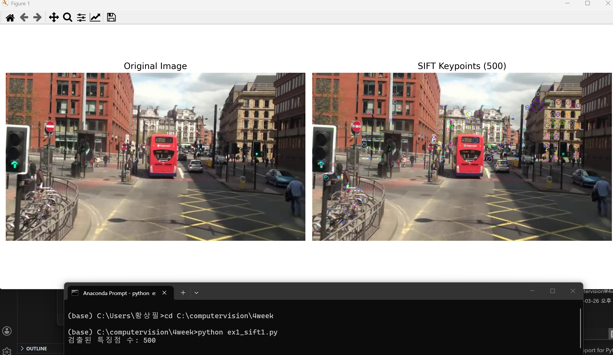
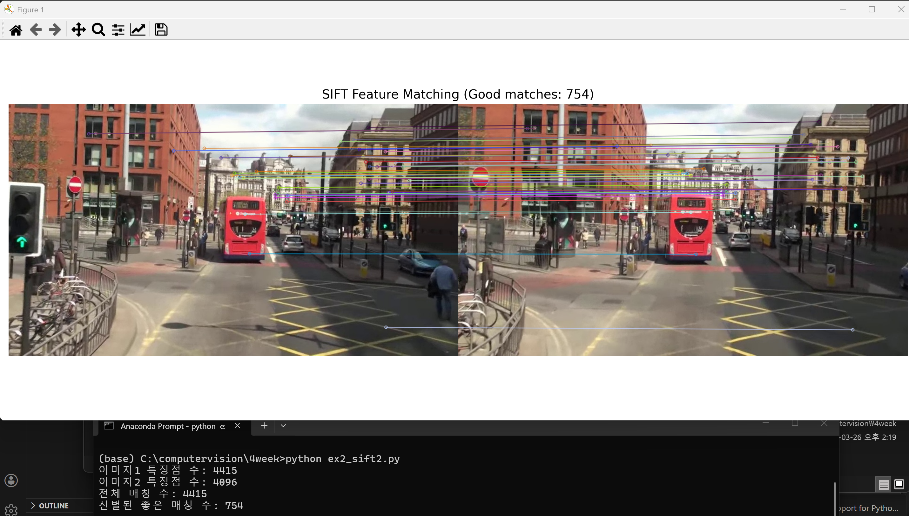
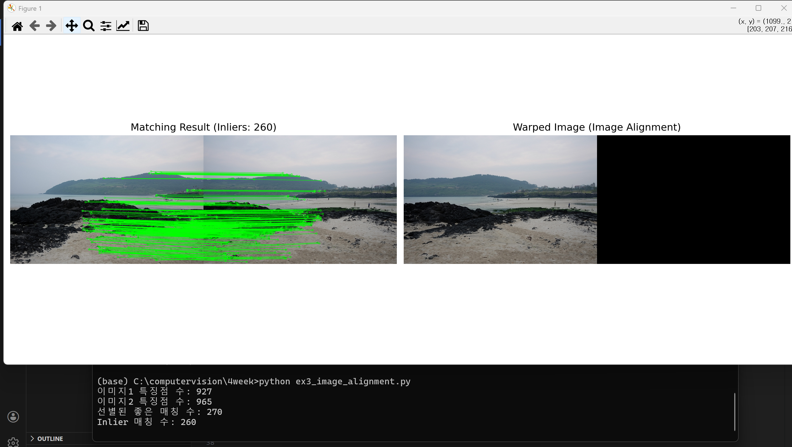

# 4주차 - SIFT 특징점 검출 및 이미지 정합

OpenCV의 SIFT 알고리즘을 활용한 특징점 검출, 매칭, 호모그래피 기반 이미지 정합 실습입니다.

---

## 목차

1. [SIFT를 이용한 특징점 검출 및 시각화](#1-sift를-이용한-특징점-검출-및-시각화)
2. [SIFT를 이용한 두 영상 간 특징점 매칭](#2-sift를-이용한-두-영상-간-특징점-매칭)
3. [호모그래피를 이용한 이미지 정합](#3-호모그래피를-이용한-이미지-정합-image-alignment)

---

## 1. SIFT를 이용한 특징점 검출 및 시각화

**파일:** `ex1_sift1.py`

### 알고리즘 설명

**SIFT (Scale-Invariant Feature Transform)** 는 이미지의 크기 변화, 회전, 조명 변화에 강인한 특징점을 검출하는 알고리즘입니다.
단순히 코너나 엣지를 찾는 것이 아니라, **어떤 각도·크기로 찍어도 같은 점을 다시 찾을 수 있는** 특징점을 만들어냅니다.

| 단계 | 설명 |
|------|------|
| **Scale-Space 생성** | Gaussian 블러를 다양한 스케일(σ)로 적용하여 DoG(Difference of Gaussian) 피라미드 구성 |
| **특징점 후보 검출** | DoG 공간에서 인접 26개 이웃보다 크거나 작은 극값(local extrema) 위치를 특징점 후보로 선택 |
| **특징점 정제** | 낮은 대비(contrast < 0.03)와 엣지 위의 불안정 후보를 제거하여 안정적인 특징점만 유지 |
| **방향 할당** | 각 특징점 주변의 그래디언트 방향 히스토그램을 계산 → 주 방향 부여 → **회전 불변성** 확보 |
| **디스크립터 생성** | 특징점 주변 16×16 영역을 4×4 블록으로 나눠 각 블록에서 8방향 그래디언트 히스토그램 계산 → **128차원 벡터** 생성 |

### 핵심 코드 분석

#### 핵심 1: `SIFT_create(nfeatures=500)`

```python
sift = cv.SIFT_create(nfeatures=500)
```

> **왜 핵심인가?**
> `nfeatures=500`은 검출할 특징점의 **상한선**입니다. 내부적으로는 응답 값(response)이 높은 순서대로 상위 500개만 남깁니다.
> 이 값을 지정하지 않으면 수천 개의 특징점이 검출되어 시각화가 복잡해지고, 이후 매칭 단계에서도 연산량이 급증합니다.
> 실제 응용에서는 정확도와 속도 간 트레이드오프를 고려하여 이 값을 튜닝합니다.

#### 핵심 2: `detectAndCompute(gray, None)`

```python
keypoints, descriptors = sift.detectAndCompute(gray, None)
```

> **왜 핵심인가?**
> 이 한 줄이 SIFT 파이프라인 전체를 실행합니다. 반환값은 두 가지입니다:
> - `keypoints`: 각 특징점의 위치(x, y), 크기(size), 방향(angle), 응답 강도(response) 정보
> - `descriptors`: shape `(N, 128)` — 각 특징점을 표현하는 128차원 float32 벡터 배열
>
> 두 번째 인자 `None`은 마스크(특정 영역만 탐색)인데, `None`이면 이미지 전체를 탐색합니다.
> **반드시 그레이스케일 이미지를 입력**해야 합니다. 컬러 이미지를 넣으면 오류가 발생합니다.

#### 핵심 3: `DRAW_MATCHES_FLAGS_DRAW_RICH_KEYPOINTS`

```python
img_keypoints = cv.drawKeypoints(
    img, keypoints, None,
    flags=cv.DRAW_MATCHES_FLAGS_DRAW_RICH_KEYPOINTS  # 원의 크기 = 특징점 스케일, 선 방향 = 주 방향
)
```

> **왜 핵심인가?**
> 이 플래그 없이 그리면 특징점을 단순한 점으로만 표시합니다.
> `DRAW_RICH_KEYPOINTS`를 사용하면 원의 **크기**로 해당 특징점이 검출된 스케일을,
> 원 안의 **선 방향**으로 SIFT가 할당한 주 방향(dominant orientation)을 함께 시각화합니다.
> 이를 통해 SIFT의 스케일 불변성과 회전 불변성이 실제로 어떻게 작동하는지 눈으로 확인할 수 있습니다.

### 전체 코드 (상세 주석)

```python
import cv2 as cv
import matplotlib.pyplot as plt

# ── 1. 이미지 로드 ─────────────────────────────────────────────────────────────
img = cv.imread('images/mot_color70.jpg')
# OpenCV는 이미지를 BGR 순서로 읽음 (matplotlib은 RGB를 기대하므로 나중에 변환 필요)

gray = cv.cvtColor(img, cv.COLOR_BGR2GRAY)
# SIFT는 밝기(intensity) 기반 알고리즘 → 컬러 채널이 필요 없음
# 그레이스케일로 변환해야 detectAndCompute가 정상 동작함

# ── 2. SIFT 객체 생성 ──────────────────────────────────────────────────────────
sift = cv.SIFT_create(nfeatures=500)
# nfeatures=500: 응답 강도 기준 상위 500개 특징점만 남김
# 지정하지 않으면(nfeatures=0) 수천 개까지 검출될 수 있음
# 시각화 목적이므로 500개로 제한하여 결과를 보기 쉽게 만듦

# ── 3. 특징점 검출 및 디스크립터 계산 ─────────────────────────────────────────
keypoints, descriptors = sift.detectAndCompute(gray, None)
# keypoints: KeyPoint 객체의 리스트
#   - .pt    : (x, y) 좌표
#   - .size  : 특징점이 검출된 스케일 (원의 반지름에 해당)
#   - .angle : 주 방향 (0~360도, 시계 반대 방향)
#   - .response: 특징점의 강도 (값이 클수록 더 뚜렷한 특징점)
# descriptors: shape = (N, 128), dtype = float32
#   - 각 행이 하나의 특징점을 나타내는 128차원 벡터
#   - L2 norm으로 정규화되어 있어 조명 변화에 부분적으로 강인함
# 두 번째 인자 None: 탐색 마스크 없음 → 이미지 전체 탐색

print(f'검출된 특징점 수: {len(keypoints)}')
# nfeatures=500이지만 이미지에 따라 실제 검출 수가 500 미만일 수 있음

# ── 4. 특징점 시각화 ────────────────────────────────────────────────────────────
img_keypoints = cv.drawKeypoints(
    img,        # 원본 BGR 이미지 위에 그림
    keypoints,  # 시각화할 특징점 리스트
    None,       # 출력 이미지 버퍼 (None이면 새로 생성)
    flags=cv.DRAW_MATCHES_FLAGS_DRAW_RICH_KEYPOINTS
    # DRAW_RICH_KEYPOINTS: 원의 크기 = 특징점 스케일, 선 = 주 방향
    # 이 플래그 없이 그리면 단순한 점(+)으로만 표시됨
)

# ── 5. BGR → RGB 변환 (matplotlib 출력용) ─────────────────────────────────────
img_rgb    = cv.cvtColor(img, cv.COLOR_BGR2RGB)
img_kp_rgb = cv.cvtColor(img_keypoints, cv.COLOR_BGR2RGB)
# OpenCV BGR → matplotlib RGB로 변환하지 않으면 빨간색/파란색이 뒤바뀌어 출력됨

# ── 6. 원본 vs 특징점 검출 결과 나란히 출력 ────────────────────────────────────
fig, axes = plt.subplots(1, 2, figsize=(14, 6))
# figsize=(14, 6): 가로 14인치, 세로 6인치 — 두 이미지를 나란히 보기 적합한 크기

axes[0].imshow(img_rgb)
axes[0].set_title('Original Image', fontsize=14)
axes[0].axis('off')   # x/y 축 눈금 숨김 — 이미지 시각화 시 불필요한 눈금 제거

axes[1].imshow(img_kp_rgb)
axes[1].set_title(f'SIFT Keypoints ({len(keypoints)})', fontsize=14)
# 제목에 실제 검출된 특징점 수를 표시하여 결과를 바로 파악할 수 있게 함
axes[1].axis('off')

plt.tight_layout()   # 서브플롯 간 겹침 방지 — 자동으로 여백 조정
plt.show()
```

### 결과



> 원 크기가 클수록 큰 스케일(넓은 영역)에서 검출된 특징점이며, 원 안의 선이 SIFT가 계산한 주 방향을 나타냅니다.

---

## 2. SIFT를 이용한 두 영상 간 특징점 매칭

**파일:** `ex2_sift2.py`

### 알고리즘 설명

두 이미지에서 각각 SIFT 특징점과 디스크립터를 추출한 뒤, **BFMatcher**와 **Lowe's Ratio Test**로 신뢰도 높은 대응 쌍을 선별합니다.

#### BFMatcher (Brute-Force Matcher)

- 한 이미지의 모든 디스크립터를 다른 이미지의 모든 디스크립터와 비교하는 **전수 탐색** 방식
- 이미지 1의 특징점이 N개, 이미지 2의 특징점이 M개라면 총 N×M번 거리 계산 수행
- 거리 척도: **L2 Norm (유클리드 거리)** — SIFT의 실수형 128차원 벡터에 적합
  - 이진 디스크립터(ORB, BRIEF)에는 Hamming 거리를 사용해야 함

#### knnMatch (k=2)

각 특징점에 대해 가장 가까운 **2개의 후보 매칭**을 반환합니다.
k=1이면 가장 가까운 것 1개만 반환하지만, Lowe's Ratio Test를 적용하려면 반드시 k=2가 필요합니다.

#### Lowe's Ratio Test

```
최근접 거리(m.distance) < 0.75 × 차근접 거리(n.distance)
```

- **1위 매칭**이 **2위 매칭**보다 충분히 가까울 때만 유효한 매칭으로 인정
- 임계값 `0.75` → 낮을수록 엄격한 필터링(매칭 수 감소), 높을수록 많은 매칭 허용(오매칭 증가)
- 반복 패턴이나 유사 구조에서 발생하는 **오매칭(false positive)을 효과적으로 제거**
- David Lowe의 2004년 논문에서 제안, 현재도 가장 널리 쓰이는 필터링 방법

### 핵심 코드 분석

#### 핵심 1: `BFMatcher(cv.NORM_L2)`

```python
bf = cv.BFMatcher(cv.NORM_L2)
```

> **왜 핵심인가?**
> SIFT 디스크립터는 128차원 실수 벡터이므로 두 벡터 간의 유사도를 유클리드 거리(L2 Norm)로 측정합니다.
> 만약 `cv.NORM_HAMMING`을 쓰면 이진 디스크립터 전용 거리 계산이 적용되어 올바른 결과가 나오지 않습니다.
> 거리 척도 선택이 매칭 품질에 직접 영향을 줍니다.

#### 핵심 2: `knnMatch(des1, des2, k=2)`

```python
matches = bf.knnMatch(des1, des2, k=2)
# matches[i] = [m, n]
#   m: i번째 특징점의 1위 매칭 (가장 가까운 디스크립터)
#   n: i번째 특징점의 2위 매칭 (두 번째로 가까운 디스크립터)
```

> **왜 핵심인가?**
> 단순히 `match()`로 1위 매칭만 찾으면 오매칭 여부를 판단할 근거가 없습니다.
> 2위 매칭(n)이 있어야 Lowe's Ratio Test에서 "1위가 2위보다 얼마나 더 가까운가"를 비교할 수 있습니다.
> k=2는 Ratio Test의 필수 조건입니다.

#### 핵심 3: Lowe's Ratio Test

```python
good_matches = []
for m, n in matches:
    if m.distance < 0.75 * n.distance:  # 1위가 2위보다 25% 이상 가까울 때만 채택
        good_matches.append(m)
```

> **왜 핵심인가?**
> 이 필터가 매칭 품질의 핵심입니다. 필터 없이 매칭하면 오매칭이 다수 포함되어 이후 호모그래피 계산이 부정확해집니다.
> 예를 들어 두 특징점의 1위/2위 거리가 비슷하다면(ratio ≈ 1.0) 어느 쪽이 진짜 대응인지 불확실하므로 제거합니다.
> 임계값 0.75는 Lowe의 실험에서 정확도와 재현율(recall)이 가장 균형 잡힌 값입니다.

### 전체 코드 (상세 주석)

```python
import cv2 as cv
import matplotlib.pyplot as plt

# ── 1. 두 이미지 로드 ──────────────────────────────────────────────────────────
img1 = cv.imread('images/mot_color70.jpg')   # 프레임 70 (기준 이미지)
img2 = cv.imread('images/mot_color83.jpg')   # 프레임 83 (비교 이미지)
# 같은 장면의 다른 시점 또는 다른 시간대 이미지 — 공통된 특징점이 존재해야 매칭 가능

gray1 = cv.cvtColor(img1, cv.COLOR_BGR2GRAY)
gray2 = cv.cvtColor(img2, cv.COLOR_BGR2GRAY)
# 두 이미지 모두 그레이스케일로 변환 — SIFT 입력 요구사항

# ── 2. 두 이미지에서 각각 SIFT 특징점 추출 ────────────────────────────────────
sift = cv.SIFT_create()
# nfeatures를 지정하지 않으면 기본값(0) → 제한 없이 모든 특징점 검출
# 매칭 단계에서는 특징점이 많을수록 좋은 매칭을 찾을 확률이 높아짐

kp1, des1 = sift.detectAndCompute(gray1, None)
kp2, des2 = sift.detectAndCompute(gray2, None)
# des1.shape = (N1, 128), des2.shape = (N2, 128)
# 두 디스크립터 행렬의 행 수(N1, N2)는 달라도 열 수(128)는 항상 동일

print(f'이미지1 특징점 수: {len(kp1)}')
print(f'이미지2 특징점 수: {len(kp2)}')

# ── 3. BFMatcher로 특징점 매칭 ────────────────────────────────────────────────
bf = cv.BFMatcher(cv.NORM_L2)
# NORM_L2: 유클리드 거리 사용 → SIFT의 실수형 128차원 벡터에 적합
# ORB/BRIEF 같은 이진 디스크립터는 NORM_HAMMING을 사용해야 함

matches = bf.knnMatch(des1, des2, k=2)
# des1의 각 행(특징점)마다 des2에서 가장 가까운 2개의 디스크립터를 찾음
# 반환: 리스트의 리스트 — matches[i] = [m, n]
#   m.distance: 1위 매칭 거리 (작을수록 유사)
#   n.distance: 2위 매칭 거리
# 전체 연산량: N1 × N2 번의 L2 거리 계산 (Brute-Force)

# ── 4. Lowe's Ratio Test — 신뢰도 높은 매칭만 선별 ────────────────────────────
good_matches = []
for m, n in matches:
    if m.distance < 0.75 * n.distance:
        # 1위 매칭이 2위 매칭 거리의 75% 미만일 때만 채택
        # 즉, 1위가 2위보다 25% 이상 가까울 만큼 "명확하게" 더 좋은 매칭일 때만 유효
        # 0.75 대신 0.7을 쓰면 더 엄격한 필터 → 매칭 수 감소, 품질 향상
        # 0.75 대신 0.8을 쓰면 더 느슨한 필터 → 매칭 수 증가, 오매칭 증가
        good_matches.append(m)

print(f'전체 매칭 수: {len(matches)}')
print(f'선별된 좋은 매칭 수: {len(good_matches)}')

# ── 5. 매칭 결과 시각화 (거리 기준 정렬 후 상위 50개) ─────────────────────────
good_matches_sorted = sorted(good_matches, key=lambda x: x.distance)
# 거리(distance)가 작을수록 더 확실한 매칭 → 오름차순 정렬 후 상위 50개만 시각화
# 모든 good_matches를 그리면 선이 너무 많아 시각적으로 파악하기 어려움

img_matches = cv.drawMatches(
    img1, kp1,              # 왼쪽에 표시할 이미지와 특징점
    img2, kp2,              # 오른쪽에 표시할 이미지와 특징점
    good_matches_sorted[:50], None,  # 상위 50개 매칭만 선으로 연결
    flags=cv.DrawMatchesFlags_NOT_DRAW_SINGLE_POINTS
    # 매칭되지 않은 단독 특징점은 그리지 않음 → 매칭 선만 깔끔하게 표시
)

img_matches_rgb = cv.cvtColor(img_matches, cv.COLOR_BGR2RGB)

# ── 6. 결과 출력 ────────────────────────────────────────────────────────────────
plt.figure(figsize=(16, 6))
plt.imshow(img_matches_rgb)
plt.title(f'SIFT Feature Matching (Good matches: {len(good_matches)})', fontsize=14)
# 제목에 전체 good_matches 수를 표시 (시각화는 상위 50개지만 실제 선별 수는 더 많음)
plt.axis('off')
plt.tight_layout()
plt.show()
```

### 결과



> 두 이미지를 이어붙인 뒤 선으로 대응점을 연결합니다. 선이 교차하지 않고 대체로 평행하다면 매칭 품질이 높다는 신호입니다.

---

## 3. 호모그래피를 이용한 이미지 정합 (Image Alignment)

**파일:** `ex3_image_alignment.py`

### 알고리즘 설명

SIFT 매칭으로 얻은 대응점 쌍을 이용해 **호모그래피 행렬**을 추정하고, 이를 통해 두 이미지를 하나의 평면으로 정합합니다.

#### 호모그래피 (Homography)

같은 평면을 다른 시점에서 촬영한 두 이미지 간의 **투영 변환(Projective Transformation)** 을 나타내는 3×3 행렬입니다.
이동, 회전, 스케일, 원근 왜곡을 모두 하나의 행렬로 표현할 수 있어 이미지 정합·파노라마·AR에 핵심적으로 사용됩니다.

```
[x']     [h11 h12 h13]   [x]
[y']  =  [h21 h22 h23] × [y]
[w']     [h31 h32  1 ]   [1]

실제 좌표: X' = x'/w',  Y' = y'/w'
```

- 자유도 8 → 최소 **4쌍의 대응점**이 있어야 행렬을 결정할 수 있음
- 행과 열의 마지막 원소를 1로 고정하여 스케일 모호성 제거

#### RANSAC (Random Sample Consensus)

오매칭(outlier)이 섞인 대응점에서 신뢰할 수 있는 호모그래피를 추정하는 방법입니다.
Lowe's Ratio Test를 통과했어도 일부 오매칭이 남아 있을 수 있으며, 이를 RANSAC이 걸러냅니다.

| 단계 | 설명 |
|------|------|
| **샘플링** | 대응점 중 최소 4쌍을 무작위 선택 |
| **모델 추정** | 선택한 4쌍으로 호모그래피 행렬 계산 |
| **검증** | 모든 대응점에 행렬 적용 → 재투영 오차가 임계값(5px) 이하인 점을 **inlier**로 분류 |
| **반복** | 위 과정을 반복하여 inlier가 가장 많은 모델 선택 |
| **재추정** | 최종 inlier 전체로 다시 최소자승 호모그래피 계산 → 정밀도 향상 |

#### warpPerspective

추정된 호모그래피 행렬로 img1의 모든 픽셀을 변환하여 img2의 시점에 맞게 정렬합니다.

### 핵심 코드 분석

#### 핵심 1: 대응점 배열 구성

```python
src_pts = np.float32([kp1[m.queryIdx].pt for m in good_matches]).reshape(-1, 1, 2)
dst_pts = np.float32([kp2[m.trainIdx].pt for m in good_matches]).reshape(-1, 1, 2)
```

> **왜 핵심인가?**
> `m.queryIdx`는 img1의 특징점 인덱스, `m.trainIdx`는 img2의 특징점 인덱스입니다.
> `.pt`로 (x, y) 좌표를 꺼내어 `float32` 배열로 만들고 `.reshape(-1, 1, 2)`로 변환합니다.
> `findHomography`가 요구하는 정확한 입력 형식 `(N, 1, 2)`을 맞추기 위한 reshape입니다.
> 이 형식이 틀리면 호모그래피 계산 자체가 실패합니다.

#### 핵심 2: `findHomography(src_pts, dst_pts, cv.RANSAC, 5.0)`

```python
H, mask = cv.findHomography(src_pts, dst_pts, cv.RANSAC, 5.0)
```

> **왜 핵심인가?**
> `H`는 img1 → img2 변환을 나타내는 3×3 호모그래피 행렬입니다.
> `mask`는 각 대응점이 inlier(1)인지 outlier(0)인지를 나타내는 배열입니다.
> 세 번째 인자 `cv.RANSAC`은 RANSAC 방법으로 outlier를 제거하면서 계산하도록 지시합니다.
> 네 번째 인자 `5.0`은 재투영 오차 임계값(픽셀 단위) — 변환 후 좌표가 실제 좌표와 5px 이내면 inlier로 간주합니다.
> RANSAC 없이 최소자승법만 쓰면 오매칭 하나로도 H가 크게 틀어질 수 있습니다.

#### 핵심 3: `warpPerspective` + 이미지 합성

```python
output_size = (w1 + w2, max(h1, h2))
warped = cv.warpPerspective(img1, H, output_size)

result = warped.copy()
result[0:h2, 0:w2] = img2
```

> **왜 핵심인가?**
> `warpPerspective`는 H 행렬을 사용해 img1의 모든 픽셀을 새 좌표로 이동시킵니다.
> `output_size = (w1 + w2, max(h1, h2))`로 두 이미지를 나란히 놓을 만큼 넉넉한 캔버스를 만듭니다.
> 그 다음 `result[0:h2, 0:w2] = img2`로 변환된 img1 위에 img2를 덮어씌워 정합 결과를 완성합니다.
> 이 방식은 파노라마 이미지를 만드는 가장 기본적인 구조와 동일합니다.

### 전체 코드 (상세 주석)

```python
import cv2 as cv
import numpy as np
import matplotlib.pyplot as plt

# ── 1. 두 이미지 로드 ──────────────────────────────────────────────────────────
img1 = cv.imread('images/img1.jpg')   # 변환(warp)할 이미지 — img2의 시점에 맞게 정렬될 대상
img2 = cv.imread('images/img2.jpg')   # 기준(reference) 이미지 — 이 시점을 기준으로 정합

gray1 = cv.cvtColor(img1, cv.COLOR_BGR2GRAY)
gray2 = cv.cvtColor(img2, cv.COLOR_BGR2GRAY)

# ── 2. SIFT 특징점 검출 ─────────────────────────────────────────────────────────
sift = cv.SIFT_create()
kp1, des1 = sift.detectAndCompute(gray1, None)
kp2, des2 = sift.detectAndCompute(gray2, None)

print(f'이미지1 특징점 수: {len(kp1)}')
print(f'이미지2 특징점 수: {len(kp2)}')

# ── 3. BFMatcher + knnMatch로 매칭 ────────────────────────────────────────────
bf = cv.BFMatcher(cv.NORM_L2)
matches = bf.knnMatch(des1, des2, k=2)
# des1 각 행마다 des2에서 가장 가까운 2개를 찾음

# ── 4. Lowe's Ratio Test (임계값 0.7 — ex2보다 더 엄격) ───────────────────────
good_matches = []
for m, n in matches:
    if m.distance < 0.7 * n.distance:
        # 0.7로 더 엄격하게 필터링 — 호모그래피 계산에는 품질이 높은 매칭이 필수
        # ex2에서 쓴 0.75보다 낮아서 매칭 수는 줄지만, 오매칭 포함 확률이 낮아짐
        good_matches.append(m)

print(f'선별된 좋은 매칭 수: {len(good_matches)}')
# 호모그래피 계산을 위해 최소 4개 이상의 매칭이 필요 (이론적 최솟값)
# 실제로는 10개 이상은 되어야 RANSAC이 안정적으로 동작함

# ── 5. 호모그래피 계산을 위한 대응점 배열 구성 ────────────────────────────────
src_pts = np.float32([kp1[m.queryIdx].pt for m in good_matches]).reshape(-1, 1, 2)
# kp1[m.queryIdx].pt: img1의 매칭된 특징점 (x, y) 좌표
# reshape(-1, 1, 2): findHomography가 요구하는 입력 형식 (N, 1, 2)

dst_pts = np.float32([kp2[m.trainIdx].pt for m in good_matches]).reshape(-1, 1, 2)
# kp2[m.trainIdx].pt: img2의 매칭된 특징점 (x, y) 좌표
# src_pts[i] ↔ dst_pts[i]: i번째 대응점 쌍 (img1의 점 → img2의 점)

# ── 6. RANSAC을 이용한 호모그래피 행렬 계산 ────────────────────────────────────
H, mask = cv.findHomography(src_pts, dst_pts, cv.RANSAC, 5.0)
# H   : shape (3, 3), dtype float64 — img1 좌표를 img2 좌표로 변환하는 행렬
# mask: shape (N, 1), dtype uint8 — 1이면 inlier, 0이면 outlier
# 5.0 : 재투영 오차 임계값(픽셀) — 변환 후 예측 위치와 실제 위치의 차이가 5px 이내면 inlier

inliers = mask.ravel().sum()
# mask.ravel(): 1차원으로 펼침 (N,) → inlier(1)의 합산 = inlier 수
print(f'Inlier 매칭 수: {inliers}')
# inlier 비율(inliers / len(good_matches))이 높을수록 매칭 품질과 H 정확도가 높음

# ── 7. warpPerspective로 img1을 img2 시점에 맞게 변환 ─────────────────────────
h1, w1 = img1.shape[:2]
h2, w2 = img2.shape[:2]
output_size = (w1 + w2, max(h1, h2))
# 두 이미지를 나란히 붙인 크기의 캔버스 생성
# w1 + w2: 가로 방향으로 두 이미지가 모두 들어갈 충분한 너비
# max(h1, h2): 둘 중 더 높은 이미지 기준으로 세로 크기 결정

warped = cv.warpPerspective(img1, H, output_size)
# H를 이용해 img1의 각 픽셀을 새 위치로 이동
# 변환 후 빈 영역(검은색)은 나중에 img2로 채워짐
# output_size 밖으로 나가는 픽셀은 잘림

# ── 8. img2를 warped 이미지 왼쪽에 합성 ──────────────────────────────────────
result = warped.copy()
result[0:h2, 0:w2] = img2
# warped(변환된 img1) 위에 img2를 (0,0) 위치부터 덮어씌움
# → 오른쪽에는 H로 변환된 img1, 왼쪽에는 기준 이미지 img2가 자연스럽게 이어짐

# ── 9. inlier 매칭만 시각화 ───────────────────────────────────────────────────
matchesMask = mask.ravel().tolist()
# mask를 파이썬 리스트로 변환 — drawMatches의 matchesMask 인자로 사용
# matchesMask[i] = 1이면 i번째 매칭을 그림, 0이면 건너뜀

draw_params = dict(
    matchColor=(0, 255, 0),       # 매칭 선 색: 초록색 (BGR 아닌 RGB로 해석됨)
    singlePointColor=None,         # 매칭 안 된 단독 특징점: 그리지 않음
    matchesMask=matchesMask,       # inlier만 선택적으로 표시
    flags=cv.DrawMatchesFlags_NOT_DRAW_SINGLE_POINTS
)
img_matches = cv.drawMatches(img1, kp1, img2, kp2, good_matches, None, **draw_params)
# good_matches 전체를 넘기지만 matchesMask에 의해 inlier에 해당하는 것만 실제로 그려짐

# ── 10. BGR → RGB 변환 및 결과 출력 ───────────────────────────────────────────
result_rgb     = cv.cvtColor(result, cv.COLOR_BGR2RGB)
img_matches_rgb = cv.cvtColor(img_matches, cv.COLOR_BGR2RGB)

fig, axes = plt.subplots(1, 2, figsize=(18, 6))

axes[0].imshow(img_matches_rgb)
axes[0].set_title(f'Matching Result (Inliers: {inliers})', fontsize=13)
# 제목에 inlier 수를 표시 — RANSAC이 얼마나 많은 매칭을 신뢰했는지 직접 확인
axes[0].axis('off')

axes[1].imshow(result_rgb)
axes[1].set_title('Warped Image (Image Alignment)', fontsize=13)
# img1이 img2와 같은 시점으로 변환되어 자연스럽게 이어진 결과
axes[1].axis('off')

plt.tight_layout()
plt.show()
```

### 결과



> 왼쪽 그림에서 초록선(inlier)이 많고 선이 교차하지 않을수록 정합 품질이 높습니다.
> 오른쪽 그림에서 두 이미지의 경계가 자연스럽게 이어지면 호모그래피 추정이 성공한 것입니다.

---

## 세 실습의 연결 관계

```
ex1_sift1.py          ex2_sift2.py              ex3_image_alignment.py
─────────────         ─────────────────         ──────────────────────────────
SIFT 특징점 검출  →   두 이미지 간 매칭    →    호모그래피 추정 + 이미지 정합
(detectAndCompute)    (BFMatcher + RatioTest)    (findHomography + warpPerspective)
```

각 실습은 독립적이지만, 실제 파이프라인에서는 순서대로 이어집니다:
1. 특징점을 검출하고
2. 두 이미지의 특징점을 매칭하고
3. 매칭 결과로 기하학적 변환을 추정하여 이미지를 정합합니다.

---

## 실행 환경

```
Python 3.x
opencv-python
numpy
matplotlib
```

## 파일 구조

```
4week/
├── images/
│   ├── mot_color70.jpg   # ex1, ex2 입력 이미지
│   ├── mot_color83.jpg   # ex2 입력 이미지
│   ├── img1.jpg          # ex3 입력 이미지
│   ├── img2.jpg          # ex3 입력 이미지
│   └── img3.jpg          # ex3 추가 이미지
├── result/
│   ├── result1.png       # 특징점 검출 결과
│   ├── result2.png       # 특징점 매칭 결과
│   └── result3.png       # 이미지 정합 결과
├── ex1_sift1.py
├── ex2_sift2.py
├── ex3_image_alignment.py
└── README.md
```
