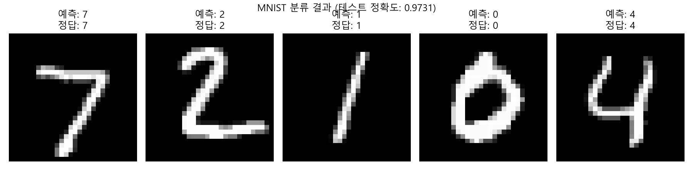
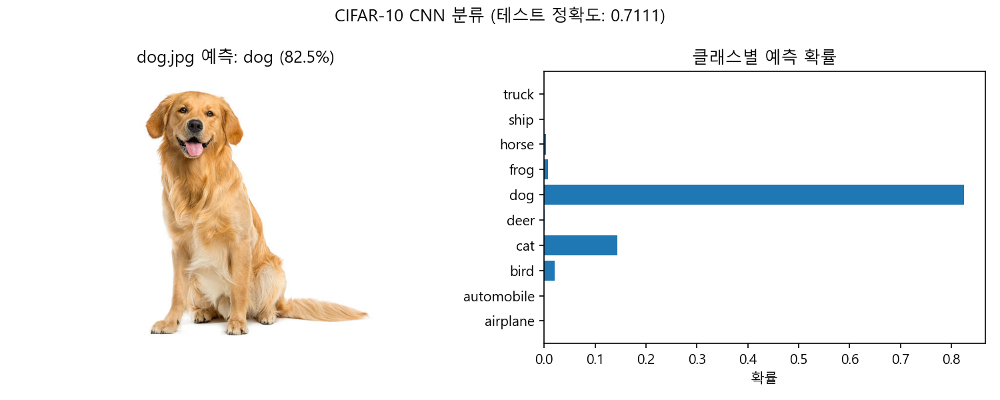

# 5주차 - Image Recognition (이미지 인식)

TensorFlow/Keras를 활용한 손글씨 숫자 분류(MNIST)와 CIFAR-10 이미지 분류(CNN) 실습입니다.

---

## 목차

1. [간단한 이미지 분류기 구현 (MNIST)](#1-간단한-이미지-분류기-구현-mnist)
2. [CIFAR-10 데이터셋을 활용한 CNN 모델 구축](#2-cifar-10-데이터셋을-활용한-cnn-모델-구축)

---

## 1. 간단한 이미지 분류기 구현 (MNIST)

**파일:** `01_mnist_classifier.py`

### 알고리즘 설명

**MNIST 데이터셋**은 0~9까지의 손글씨 숫자를 28×28 픽셀 흑백 이미지로 구성한 대표적인 이미지 분류 벤치마크입니다.
간단한 **완전 연결 신경망(Fully Connected Neural Network)**을 사용하여 각 이미지가 어떤 숫자인지 분류합니다.

| 단계 | 설명 |
|------|------|
| **데이터 로드** | `tf.keras.datasets.mnist`에서 60,000장의 훈련 데이터와 10,000장의 테스트 데이터를 불러옴 |
| **전처리** | 픽셀 값을 0~255에서 0~1 범위로 정규화하여 학습 안정성 향상 |
| **모델 구축** | Flatten → Dense(128, ReLU) → Dense(64, ReLU) → Dense(10, Softmax) |
| **훈련** | Adam 옵티마이저, Sparse Categorical Crossentropy 손실 함수, 5 에폭 |
| **평가** | 테스트 세트에 대한 정확도 측정 및 예측 결과 시각화 |

### 핵심 코드 분석

#### 핵심 1: 데이터 정규화

```python
x_train = x_train / 255.0
x_test = x_test / 255.0
```

> 원본 픽셀 값은 0~255 정수입니다. 이를 0~1 실수로 변환하면 그래디언트 크기가 적절해져서
> 학습이 안정적으로 수렴합니다. 정규화하지 않으면 가중치 업데이트가 불안정해질 수 있습니다.

#### 핵심 2: 모델 구조

```python
model = Sequential([
    Flatten(input_shape=(28, 28)),       # 28x28 이미지를 784 벡터로 변환
    Dense(128, activation='relu'),        # 은닉층 128개 뉴런
    Dense(64, activation='relu'),         # 은닉층 64개 뉴런
    Dense(10, activation='softmax')       # 출력층 10개 클래스 (0~9)
])
```

> - `Flatten`: 2D 이미지(28×28)를 1D 벡터(784)로 펼칩니다. Dense 레이어는 1D 입력만 받기 때문입니다.
> - `Dense(128, 'relu')`: 128개의 뉴런을 가진 은닉층. ReLU 활성화 함수는 음수를 0으로 만들어 비선형성을 부여합니다.
> - `Dense(10, 'softmax')`: 10개 클래스에 대한 확률 분포를 출력합니다. 모든 출력의 합은 1이 됩니다.

#### 핵심 3: 컴파일 및 훈련

```python
model.compile(optimizer='adam',
              loss='sparse_categorical_crossentropy',
              metrics=['accuracy'])

history = model.fit(x_train, y_train, epochs=5, batch_size=32,
                    validation_split=0.1)
```

> - `adam`: 학습률을 자동 조절하는 적응형 옵티마이저로, SGD보다 빠르게 수렴합니다.
> - `sparse_categorical_crossentropy`: 정수형 레이블(0~9)을 직접 사용할 수 있는 손실 함수입니다.
> - `validation_split=0.1`: 훈련 데이터의 10%를 검증용으로 분리하여 과적합 여부를 모니터링합니다.

### 전체 코드 (상세 주석)

```python
import tensorflow as tf
from tensorflow.keras.models import Sequential
from tensorflow.keras.layers import Dense, Flatten
import matplotlib.pyplot as plt
import matplotlib
matplotlib.rcParams['font.family'] = 'Malgun Gothic'
matplotlib.rcParams['axes.unicode_minus'] = False

# ── 1. MNIST 데이터셋 로드 ────────────────────────────────────────────────────
(x_train, y_train), (x_test, y_test) = tf.keras.datasets.mnist.load_data()
# x_train: (60000, 28, 28) — 60,000장의 28×28 흑백 이미지
# y_train: (60000,) — 각 이미지의 정답 레이블 (0~9)
# x_test/y_test: 10,000장의 테스트 데이터

# ── 2. 데이터 전처리 (0~1 정규화) ─────────────────────────────────────────────
x_train = x_train / 255.0
x_test = x_test / 255.0
# 0~255 정수 → 0~1 실수로 변환하여 학습 안정성 확보

# ── 3. 간단한 신경망 모델 구축 ────────────────────────────────────────────────
model = Sequential([
    Flatten(input_shape=(28, 28)),       # 28x28 → 784 벡터로 평탄화
    Dense(128, activation='relu'),        # 은닉층 1: 128개 뉴런, ReLU 활성화
    Dense(64, activation='relu'),         # 은닉층 2: 64개 뉴런, ReLU 활성화
    Dense(10, activation='softmax')       # 출력층: 10개 클래스 확률 출력
])

# ── 4. 모델 컴파일 ────────────────────────────────────────────────────────────
model.compile(optimizer='adam',
              loss='sparse_categorical_crossentropy',
              metrics=['accuracy'])

# ── 5. 모델 훈련 ─────────────────────────────────────────────────────────────
history = model.fit(x_train, y_train, epochs=5, batch_size=32,
                    validation_split=0.1)
# epochs=5: 전체 데이터를 5번 반복 학습
# batch_size=32: 32개 샘플씩 묶어서 가중치 업데이트
# validation_split=0.1: 훈련 데이터의 10%를 검증용으로 사용

# ── 6. 모델 평가 ─────────────────────────────────────────────────────────────
test_loss, test_acc = model.evaluate(x_test, y_test)
print(f"\n테스트 정확도: {test_acc:.4f}")

# ── 7. 예측 결과 시각화 ──────────────────────────────────────────────────────
predictions = model.predict(x_test[:5])

plt.figure(figsize=(12, 3))
for i in range(5):
    plt.subplot(1, 5, i + 1)
    plt.imshow(x_test[i], cmap='gray')
    plt.title(f"예측: {predictions[i].argmax()}\n정답: {y_test[i]}")
    plt.axis('off')
plt.suptitle(f"MNIST 분류 결과 (테스트 정확도: {test_acc:.4f})")
plt.tight_layout()
plt.savefig('01_mnist_result.png', dpi=150)
plt.show()
```

### 결과



> 5 에폭만으로도 약 97% 이상의 테스트 정확도를 달성합니다. Flatten + Dense만으로 구성된 간단한 구조이지만, MNIST처럼 비교적 단순한 이미지에는 충분한 성능을 보입니다.

---

## 2. CIFAR-10 데이터셋을 활용한 CNN 모델 구축

**파일:** `02_cifar10_cnn.py`

### 알고리즘 설명

**CIFAR-10**은 비행기, 자동차, 새, 고양이 등 10개 클래스의 32×32 컬러 이미지 60,000장으로 구성된 데이터셋입니다.
MNIST와 달리 컬러 이미지이고 형태가 복잡하기 때문에, **합성곱 신경망(CNN)**을 사용하여 공간적 특징을 효과적으로 추출합니다.

| 단계 | 설명 |
|------|------|
| **데이터 로드** | `tf.keras.datasets.cifar10`에서 50,000장 훈련 + 10,000장 테스트 데이터 로드 |
| **전처리** | 픽셀 값을 0~1로 정규화 |
| **모델 구축** | Conv2D(32) → MaxPool → Conv2D(64) → MaxPool → Conv2D(64) → Flatten → Dense(64) → Dense(10) |
| **훈련** | Adam 옵티마이저, 10 에폭 |
| **평가** | 테스트 세트 정확도 측정 + 외부 이미지(dog.jpg) 예측 |

### 핵심 코드 분석

#### 핵심 1: CNN 모델 구조

```python
model = Sequential([
    Conv2D(32, (3, 3), activation='relu', input_shape=(32, 32, 3)),
    MaxPooling2D((2, 2)),
    Conv2D(64, (3, 3), activation='relu'),
    MaxPooling2D((2, 2)),
    Conv2D(64, (3, 3), activation='relu'),
    Flatten(),
    Dense(64, activation='relu'),
    Dense(10, activation='softmax')
])
```

> - `Conv2D(32, (3, 3))`: 3×3 크기의 필터 32개로 이미지를 스캔합니다. 각 필터가 엣지, 텍스처 등 하나의 특징을 감지합니다.
> - `MaxPooling2D((2, 2))`: 2×2 영역에서 최대값만 남겨 공간 크기를 절반으로 줄입니다. 연산량 감소와 함께 위치 변화에 대한 강인성을 부여합니다.
> - 합성곱 → 풀링을 반복하면서 저수준 특징(엣지)에서 고수준 특징(형태, 패턴)까지 계층적으로 추출합니다.
> - `Flatten()` 이후 Dense 레이어로 최종 분류를 수행합니다.

#### 핵심 2: 외부 이미지 예측

```python
img = Image.open('dog.jpg')
img_resized = img.resize((32, 32))
img_array = np.array(img_resized) / 255.0
img_input = np.expand_dims(img_array, axis=0)

prediction = model.predict(img_input)
```

> - CIFAR-10 모델은 32×32 입력을 기대하므로, 원본 이미지를 `resize`로 축소합니다.
> - 훈련 때와 동일하게 0~1 정규화를 적용해야 합니다.
> - `expand_dims`로 배치 차원을 추가합니다. 모델은 `(batch, height, width, channels)` 형태의 4D 텐서를 입력으로 받기 때문입니다.

#### 핵심 3: Dense(FC)와 CNN의 차이

| 구분 | Dense (과제 1) | CNN (과제 2) |
|------|---------------|-------------|
| **입력 처리** | 이미지를 1D로 펼침 → 공간 정보 손실 | 2D 구조 유지 → 공간 정보 보존 |
| **파라미터 수** | 모든 뉴런이 모든 입력과 연결 → 파라미터 많음 | 필터 공유(weight sharing) → 파라미터 적음 |
| **적합한 데이터** | 단순한 이미지 (MNIST 등) | 복잡한 컬러 이미지 (CIFAR-10, 실사 이미지 등) |
| **특징 추출** | 수동 (학습이 어려움) | 자동으로 계층적 특징 추출 |

### 전체 코드 (상세 주석)

```python
import tensorflow as tf
from tensorflow.keras.models import Sequential
from tensorflow.keras.layers import Conv2D, MaxPooling2D, Flatten, Dense
import matplotlib.pyplot as plt
import matplotlib
matplotlib.rcParams['font.family'] = 'Malgun Gothic'
matplotlib.rcParams['axes.unicode_minus'] = False
import numpy as np
from PIL import Image

# ── CIFAR-10 클래스 이름 ─────────────────────────────────────────────────────
class_names = ['airplane', 'automobile', 'bird', 'cat', 'deer',
               'dog', 'frog', 'horse', 'ship', 'truck']

# ── 1. CIFAR-10 데이터셋 로드 ────────────────────────────────────────────────
(x_train, y_train), (x_test, y_test) = tf.keras.datasets.cifar10.load_data()
# x_train: (50000, 32, 32, 3) — 50,000장의 32×32 RGB 이미지
# y_train: (50000, 1) — 각 이미지의 정답 레이블 (0~9)

# ── 2. 데이터 전처리 (0~1 정규화) ─────────────────────────────────────────────
x_train = x_train / 255.0
x_test = x_test / 255.0

# ── 3. CNN 모델 설계 ─────────────────────────────────────────────────────────
model = Sequential([
    Conv2D(32, (3, 3), activation='relu', input_shape=(32, 32, 3)),
    # 3×3 필터 32개 → 30×30×32 특징 맵 생성
    MaxPooling2D((2, 2)),
    # 2×2 풀링 → 15×15×32로 축소
    Conv2D(64, (3, 3), activation='relu'),
    # 3×3 필터 64개 → 13×13×64
    MaxPooling2D((2, 2)),
    # 2×2 풀링 → 6×6×64
    Conv2D(64, (3, 3), activation='relu'),
    # 3×3 필터 64개 → 4×4×64
    Flatten(),
    # 4×4×64 = 1024 벡터로 평탄화
    Dense(64, activation='relu'),
    # 은닉층 64개 뉴런
    Dense(10, activation='softmax')
    # 출력층 10개 클래스
])

# ── 4. 모델 컴파일 ────────────────────────────────────────────────────────────
model.compile(optimizer='adam',
              loss='sparse_categorical_crossentropy',
              metrics=['accuracy'])

# ── 5. 모델 훈련 ─────────────────────────────────────────────────────────────
history = model.fit(x_train, y_train, epochs=10, batch_size=64,
                    validation_split=0.1)

# ── 6. 모델 성능 평가 ────────────────────────────────────────────────────────
test_loss, test_acc = model.evaluate(x_test, y_test)
print(f"\n테스트 정확도: {test_acc:.4f}")

# ── 7. 테스트 이미지(dog.jpg) 예측 ───────────────────────────────────────────
img = Image.open('dog.jpg')
img_resized = img.resize((32, 32))          # CIFAR-10 입력 크기에 맞춤
img_array = np.array(img_resized) / 255.0   # 정규화
img_input = np.expand_dims(img_array, axis=0)  # 배치 차원 추가 → (1, 32, 32, 3)

prediction = model.predict(img_input)
predicted_class = class_names[np.argmax(prediction)]
confidence = np.max(prediction) * 100

print(f"\ndog.jpg 예측 결과: {predicted_class} ({confidence:.2f}%)")

# ── 8. 결과 시각화 ───────────────────────────────────────────────────────────
fig, axes = plt.subplots(1, 2, figsize=(10, 4))

axes[0].imshow(img)
axes[0].set_title(f"dog.jpg 예측: {predicted_class} ({confidence:.1f}%)")
axes[0].axis('off')

axes[1].barh(class_names, prediction[0])
axes[1].set_xlabel('확률')
axes[1].set_title('클래스별 예측 확률')

plt.suptitle(f"CIFAR-10 CNN 분류 (테스트 정확도: {test_acc:.4f})")
plt.tight_layout()
plt.savefig('02_cifar10_result.png', dpi=150)
plt.show()
```

### 결과



> CNN 모델은 10 에폭 훈련으로 약 70% 이상의 테스트 정확도를 달성합니다. dog.jpg 이미지를 입력하면 'dog' 클래스로 올바르게 분류하는 것을 확인할 수 있습니다.
> MNIST의 Dense 모델(97%+)에 비해 정확도가 낮은 이유는 CIFAR-10이 컬러 이미지이고 클래스 간 시각적 유사성이 높기 때문입니다.
