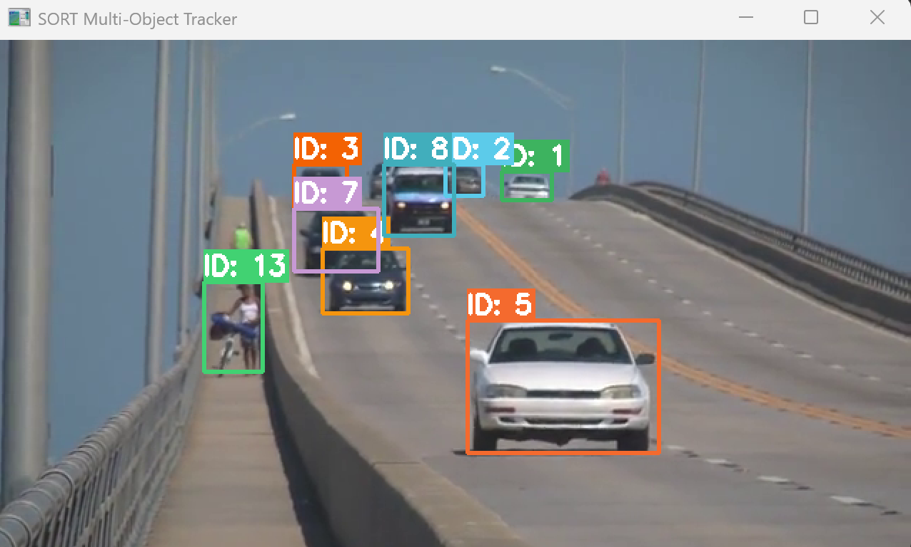
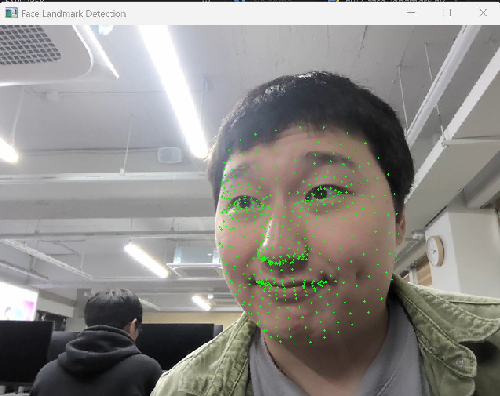

# 6주차 - Dynamic Vision (동적 비전)

YOLOv3 + SORT 알고리즘을 활용한 다중 객체 추적과 Mediapipe를 활용한 얼굴 랜드마크 실시간 검출 실습입니다.

---

## 목차

1. [SORT 알고리즘을 활용한 다중 객체 추적기 구현](#1-sort-알고리즘을-활용한-다중-객체-추적기-구현)
2. [Mediapipe를 활용한 얼굴 랜드마크 추출 및 시각화](#2-mediapipe를-활용한-얼굴-랜드마크-추출-및-시각화)

---

## 1. SORT 알고리즘을 활용한 다중 객체 추적기 구현

**파일:** `hw1_sort_tracker.py`

### 알고리즘 설명

**SORT(Simple Online and Realtime Tracking)**는 칼만 필터와 헝가리안 알고리즘을 결합하여 비디오에서 다중 객체를 실시간으로 추적하는 알고리즘입니다.
YOLOv3로 매 프레임에서 객체를 검출하고, SORT가 프레임 간 동일 객체를 연결하여 고유 ID를 부여합니다.

| 단계 | 설명 |
|------|------|
| **객체 검출** | YOLOv3 사전 훈련 모델로 각 프레임에서 객체의 바운딩 박스를 검출 |
| **상태 예측** | 칼만 필터로 각 트래커의 다음 프레임 위치를 예측 |
| **데이터 연관** | IoU 기반 비용 행렬을 구성하고 헝가리안 알고리즘으로 검출-트래커 최적 매칭 |
| **트래커 관리** | 매칭된 트래커 업데이트, 미매칭 검출에 새 트래커 생성, 오래된 트래커 제거 |
| **결과 시각화** | 각 객체에 고유 ID와 색상별 경계 상자를 비디오 프레임에 실시간 표시 |

### 핵심 코드 분석

#### 핵심 1: 칼만 필터 상태 모델

```python
self.kf = KalmanFilter(dim_x=7, dim_z=4)
# 상태 벡터: [cx, cy, area, ratio, vx, vy, va]
# 관측 벡터: [cx, cy, area, ratio]
```

> 각 객체의 상태를 7차원 벡터로 표현합니다. 중심 좌표(cx, cy), 면적(area), 종횡비(ratio)의 4개 관측값과 이들의 속도(vx, vy, va) 3개를 포함합니다.
> 상태 전이 행렬 `F`는 등속 운동 모델을 가정하여 다음 프레임의 위치를 예측합니다.

#### 핵심 2: IoU 기반 비용 행렬과 헝가리안 알고리즘

```python
cost = iou_matrix(detections, predicted)
row_idx, col_idx = linear_sum_assignment(-cost)
```

> - **IoU(Intersection over Union)**: 두 바운딩 박스의 겹치는 영역 비율을 계산합니다. 값이 클수록 같은 객체일 가능성이 높습니다.
> - **헝가리안 알고리즘**: IoU 비용 행렬에서 전체 매칭 비용을 최소화(IoU 최대화)하는 최적의 검출-트래커 쌍을 찾습니다.
> - IoU가 임계값(0.3) 미만인 쌍은 매칭에서 제외하여 잘못된 연결을 방지합니다.

#### 핵심 3: YOLOv3 객체 검출 + NMS

```python
blob = cv2.dnn.blobFromImage(frame, 1 / 255.0, (416, 416), swapRB=True, crop=False)
net.setInput(blob)
outputs = net.forward(output_layers)
```

> - OpenCV DNN 모듈로 YOLOv3 모델을 로드하고, 프레임을 416×416 blob으로 변환하여 추론합니다.
> - 신뢰도 임계값(0.5) 이상인 검출만 사용하고, **NMS(Non-Maximum Suppression)**로 중복 박스를 제거합니다.

#### 핵심 4: 트래커 생명주기 관리

```python
self.trackers = [t for t in self.trackers if t.time_since_update <= self.max_age]
for trk in self.trackers:
    if trk.hit_streak >= self.min_hits or trk.time_since_update == 0:
        box = trk.get_state()
        results.append(np.append(box, trk.id))
```

> - `max_age=5`: 5프레임 연속으로 매칭되지 않은 트래커는 삭제하여 사라진 객체를 정리합니다.
> - `min_hits=3`: 최소 3번 이상 연속 매칭된 트래커만 결과로 출력하여 오탐을 줄입니다.

### 전체 코드 (상세 주석)

```python
import cv2
import numpy as np
from filterpy.kalman import KalmanFilter
from scipy.optimize import linear_sum_assignment

# ── 칼만 필터 기반 개별 트래커 ────────────────────────────────────────────────
class KalmanBoxTracker:
    """바운딩 박스에 대한 칼만 필터 트래커"""
    count = 0

    def __init__(self, bbox):
        # 상태: [x_center, y_center, area, aspect_ratio, vx, vy, va]
        self.kf = KalmanFilter(dim_x=7, dim_z=4)
        self.kf.F = np.array([          # 상태 전이 행렬 (등속 운동 모델)
            [1, 0, 0, 0, 1, 0, 0],
            [0, 1, 0, 0, 0, 1, 0],
            [0, 0, 1, 0, 0, 0, 1],
            [0, 0, 0, 1, 0, 0, 0],
            [0, 0, 0, 0, 1, 0, 0],
            [0, 0, 0, 0, 0, 1, 0],
            [0, 0, 0, 0, 0, 0, 1],
        ])
        self.kf.H = np.array([          # 관측 행렬 (상태 → 관측)
            [1, 0, 0, 0, 0, 0, 0],
            [0, 1, 0, 0, 0, 0, 0],
            [0, 0, 1, 0, 0, 0, 0],
            [0, 0, 0, 1, 0, 0, 0],
        ])
        self.kf.R[2:, 2:] *= 10.0      # 관측 노이즈 (면적/비율에 더 큰 불확실성)
        self.kf.P[4:, 4:] *= 1000.0    # 초기 속도 불확실성 (큰 값)
        self.kf.P *= 10.0              # 전체 초기 불확실성
        self.kf.Q[-1, -1] *= 0.01      # 프로세스 노이즈
        self.kf.Q[4:, 4:] *= 0.01

        self.kf.x[:4] = self._bbox_to_z(bbox)  # 초기 상태 설정
        self.time_since_update = 0      # 마지막 매칭 이후 경과 프레임
        self.hits = 0                   # 총 매칭 횟수
        self.hit_streak = 0             # 연속 매칭 횟수
        KalmanBoxTracker.count += 1
        self.id = KalmanBoxTracker.count  # 고유 ID 부여

    @staticmethod
    def _bbox_to_z(bbox):
        """[x1, y1, x2, y2] -> [cx, cy, area, ratio] 변환"""
        w = bbox[2] - bbox[0]
        h = bbox[3] - bbox[1]
        cx = bbox[0] + w / 2.0
        cy = bbox[1] + h / 2.0
        area = w * h
        ratio = w / float(h) if h > 0 else 0
        return np.array([[cx], [cy], [area], [ratio]])

    @staticmethod
    def _z_to_bbox(z):
        """[cx, cy, area, ratio] -> [x1, y1, x2, y2] 변환"""
        cx, cy, area, ratio = z[0], z[1], z[2], z[3]
        area = max(area, 1)
        w = np.sqrt(area * ratio)
        h = area / w if w > 0 else 0
        return np.array([cx - w / 2, cy - h / 2, cx + w / 2, cy + h / 2]).flatten()

    def predict(self):
        """칼만 필터로 다음 상태 예측"""
        if self.kf.x[6] + self.kf.x[2] <= 0:
            self.kf.x[6] *= 0.0        # 면적이 음수가 되지 않도록 보정
        self.kf.predict()
        self.time_since_update += 1
        self.hit_streak = 0 if self.time_since_update > 0 else self.hit_streak
        return self._z_to_bbox(self.kf.x)

    def update(self, bbox):
        """검출 결과로 칼만 필터 상태 갱신"""
        self.time_since_update = 0
        self.hits += 1
        self.hit_streak += 1
        self.kf.update(self._bbox_to_z(bbox))

    def get_state(self):
        """현재 추정 바운딩 박스 반환"""
        return self._z_to_bbox(self.kf.x)


# ── IoU 계산 ─────────────────────────────────────────────────────────────────
def iou(bb1, bb2):
    """두 바운딩 박스의 IoU(Intersection over Union) 계산"""
    x1 = max(bb1[0], bb2[0])
    y1 = max(bb1[1], bb2[1])
    x2 = min(bb1[2], bb2[2])
    y2 = min(bb1[3], bb2[3])
    inter = max(0, x2 - x1) * max(0, y2 - y1)    # 교집합 면적
    area1 = (bb1[2] - bb1[0]) * (bb1[3] - bb1[1]) # 박스1 면적
    area2 = (bb2[2] - bb2[0]) * (bb2[3] - bb2[1]) # 박스2 면적
    union = area1 + area2 - inter                   # 합집합 면적
    return inter / union if union > 0 else 0


def iou_matrix(detections, trackers):
    """검출-트래커 간 IoU 비용 행렬 생성"""
    matrix = np.zeros((len(detections), len(trackers)))
    for d, det in enumerate(detections):
        for t, trk in enumerate(trackers):
            matrix[d, t] = iou(det, trk)
    return matrix


# ── SORT 트래커 클래스 ────────────────────────────────────────────────────────
class Sort:
    def __init__(self, max_age=5, min_hits=3, iou_threshold=0.3):
        self.max_age = max_age              # 트래커 유지 최대 프레임
        self.min_hits = min_hits            # 출력 최소 연속 매칭 수
        self.iou_threshold = iou_threshold  # 매칭 IoU 임계값
        self.trackers = []

    def update(self, detections):
        # 1) 기존 트래커의 다음 위치 예측
        predicted = []
        to_remove = []
        for i, trk in enumerate(self.trackers):
            pos = trk.predict()
            if np.any(np.isnan(pos)):
                to_remove.append(i)
            else:
                predicted.append(pos)
        for i in reversed(to_remove):
            self.trackers.pop(i)

        # 2) 헝가리안 알고리즘으로 검출-트래커 최적 매칭
        if len(detections) == 0:
            matched, unmatched_dets, unmatched_trks = [], [], list(range(len(self.trackers)))
        elif len(predicted) == 0:
            matched, unmatched_dets, unmatched_trks = [], list(range(len(detections))), []
        else:
            cost = iou_matrix(detections, predicted)
            row_idx, col_idx = linear_sum_assignment(-cost)  # IoU 최대화

            matched, unmatched_dets, unmatched_trks = [], [], []
            for d in range(len(detections)):
                if d not in row_idx:
                    unmatched_dets.append(d)
            for t in range(len(predicted)):
                if t not in col_idx:
                    unmatched_trks.append(t)
            for r, c in zip(row_idx, col_idx):
                if cost[r, c] < self.iou_threshold:  # IoU가 낮으면 매칭 거부
                    unmatched_dets.append(r)
                    unmatched_trks.append(c)
                else:
                    matched.append((r, c))

        # 3) 매칭된 트래커 상태 갱신
        for d, t in matched:
            self.trackers[t].update(detections[d])

        # 4) 미매칭 검출에 새 트래커 생성
        for d in unmatched_dets:
            self.trackers.append(KalmanBoxTracker(detections[d]))

        # 5) 오래된 트래커 제거 & 결과 수집
        results = []
        self.trackers = [t for t in self.trackers if t.time_since_update <= self.max_age]
        for trk in self.trackers:
            if trk.hit_streak >= self.min_hits or trk.time_since_update == 0:
                box = trk.get_state()
                results.append(np.append(box, trk.id))

        return np.array(results) if results else np.empty((0, 5))


# ── YOLOv3 검출기 ────────────────────────────────────────────────────────────
def load_yolo(cfg_path, weights_path, names_path):
    """YOLOv3 모델 로드"""
    net = cv2.dnn.readNetFromDarknet(cfg_path, weights_path)
    net.setPreferableBackend(cv2.dnn.DNN_BACKEND_OPENCV)
    net.setPreferableTarget(cv2.dnn.DNN_TARGET_CPU)
    with open(names_path, "r") as f:
        classes = [line.strip() for line in f if line.strip()]
    layer_names = net.getLayerNames()
    output_layers = [layer_names[i - 1] for i in net.getUnconnectedOutLayers().flatten()]
    return net, classes, output_layers


def detect_objects(frame, net, output_layers, conf_threshold=0.5, nms_threshold=0.4):
    """YOLOv3로 프레임에서 객체 검출"""
    h, w = frame.shape[:2]
    # 프레임을 416x416 blob으로 변환 (YOLOv3 입력 형식)
    blob = cv2.dnn.blobFromImage(frame, 1 / 255.0, (416, 416), swapRB=True, crop=False)
    net.setInput(blob)
    outputs = net.forward(output_layers)

    boxes, confidences, class_ids = [], [], []
    for output in outputs:
        for detection in output:
            scores = detection[5:]              # 클래스별 확률
            class_id = np.argmax(scores)         # 최대 확률 클래스
            confidence = scores[class_id]
            if confidence > conf_threshold:
                cx, cy, bw, bh = detection[0:4] * np.array([w, h, w, h])
                x1 = int(cx - bw / 2)
                y1 = int(cy - bh / 2)
                x2 = int(cx + bw / 2)
                y2 = int(cy + bh / 2)
                boxes.append([x1, y1, x2, y2])
                confidences.append(float(confidence))
                class_ids.append(class_id)

    # NMS(Non-Maximum Suppression)로 중복 검출 제거
    if boxes:
        nms_boxes = [[b[0], b[1], b[2] - b[0], b[3] - b[1]] for b in boxes]
        indices = cv2.dnn.NMSBoxes(nms_boxes, confidences, conf_threshold, nms_threshold)
        if len(indices) > 0:
            indices = indices.flatten()
            return np.array([boxes[i] for i in indices]), [class_ids[i] for i in indices]
    return np.empty((0, 4)), []


# ── 메인 실행 ────────────────────────────────────────────────────────────────
def main():
    import os
    base_dir = os.path.dirname(os.path.abspath(__file__))
    l06_dir = os.path.join(base_dir, "L06")

    cfg_path = os.path.join(l06_dir, "yolov3.cfg")
    weights_path = os.path.join(l06_dir, "yolov3.weights")
    names_path = os.path.join(l06_dir, "coco.names")
    video_path = os.path.join(l06_dir, "slow_traffic_small.mp4")

    net, classes, output_layers = load_yolo(cfg_path, weights_path, names_path)
    tracker = Sort(max_age=5, min_hits=3, iou_threshold=0.3)

    cap = cv2.VideoCapture(video_path)
    if not cap.isOpened():
        print(f"Error: 비디오를 열 수 없습니다 - {video_path}")
        return

    # 색상 팔레트 (ID별 고유 색상)
    np.random.seed(42)
    colors = np.random.randint(0, 255, size=(200, 3), dtype=np.uint8)

    print("SORT 다중 객체 추적기 실행 중... (ESC: 종료)")

    while True:
        ret, frame = cap.read()
        if not ret:
            break

        # YOLOv3 객체 검출
        detections, class_ids = detect_objects(frame, net, output_layers)

        # SORT 추적 업데이트
        tracked = tracker.update(detections)

        # 결과 시각화: ID별 색상 경계 상자 + 라벨
        for obj in tracked:
            x1, y1, x2, y2, obj_id = obj.astype(int)
            color = colors[obj_id % len(colors)].tolist()
            cv2.rectangle(frame, (x1, y1), (x2, y2), color, 2)
            label = f"ID: {obj_id}"
            (tw, th), _ = cv2.getTextSize(label, cv2.FONT_HERSHEY_SIMPLEX, 0.6, 2)
            cv2.rectangle(frame, (x1, y1 - th - 8), (x1 + tw, y1), color, -1)
            cv2.putText(frame, label, (x1, y1 - 5),
                        cv2.FONT_HERSHEY_SIMPLEX, 0.6, (255, 255, 255), 2)

        cv2.imshow("SORT Multi-Object Tracker", frame)
        if cv2.waitKey(30) & 0xFF == 27:  # ESC 키로 종료
            break

    cap.release()
    cv2.destroyAllWindows()
    print("추적 종료.")


if __name__ == "__main__":
    main()
```

### 결과



> YOLOv3가 매 프레임에서 차량 등 객체를 검출하고, SORT가 칼만 필터로 위치를 예측하여 프레임 간 동일 객체를 연결합니다.
> 각 객체에 고유 ID가 부여되어 색상별 경계 상자와 함께 실시간으로 추적 결과가 표시됩니다.

---

## 2. Mediapipe를 활용한 얼굴 랜드마크 추출 및 시각화

**파일:** `hw2_face_landmark.py`

### 알고리즘 설명

**Mediapipe FaceLandmarker**는 Google에서 개발한 실시간 얼굴 랜드마크 검출 솔루션으로, 얼굴의 **478개 랜드마크**를 추출합니다.
웹캠에서 실시간으로 영상을 캡처하고, 검출된 랜드마크를 초록색 점으로 시각화하는 프로그램을 구현합니다.

| 단계 | 설명 |
|------|------|
| **모델 준비** | FaceLandmarker 모델 파일이 없으면 자동 다운로드 |
| **검출기 초기화** | FaceLandmarker를 LIVE_STREAM 모드로 초기화 (비동기 실시간 처리) |
| **영상 캡처** | OpenCV로 웹캠 실시간 영상 캡처 + 좌우 반전(거울 효과) |
| **랜드마크 검출** | BGR → RGB 변환 후 Mediapipe에 비동기 전달, 콜백으로 결과 수신 |
| **시각화** | 정규화된 랜드마크 좌표를 픽셀 좌표로 변환 후 초록색 점 표시 |

### 핵심 코드 분석

#### 핵심 1: FaceLandmarker 초기화 (Tasks API)

```python
options = FaceLandmarkerOptions(
    base_options=BaseOptions(model_asset_path=MODEL_PATH),
    running_mode=RunningMode.LIVE_STREAM,
    num_faces=1,
    min_face_detection_confidence=0.5,
    min_face_presence_confidence=0.5,
    min_tracking_confidence=0.5,
    result_callback=on_result,
)
landmarker = FaceLandmarker.create_from_options(options)
```

> - `RunningMode.LIVE_STREAM`: 비동기 모드로, 프레임을 보내면 콜백 함수로 결과가 반환됩니다. 실시간 처리에 최적화되어 있습니다.
> - `result_callback`: 검출 완료 시 호출되는 콜백 함수. 별도 스레드에서 실행되어 메인 루프를 차단하지 않습니다.
> - `num_faces=1`: 검출할 최대 얼굴 수. 여러 얼굴을 검출하려면 이 값을 늘리면 됩니다.

#### 핵심 2: 비동기 검출 및 타임스탬프 관리

```python
rgb = cv2.cvtColor(frame, cv2.COLOR_BGR2RGB)
mp_image = mp.Image(image_format=mp.ImageFormat.SRGB, data=rgb)
landmarker.detect_async(mp_image, frame_timestamp)
frame_timestamp += 33  # ~30fps 간격
```

> - Mediapipe는 RGB 입력을 요구하므로 OpenCV의 BGR을 RGB로 변환합니다.
> - `detect_async`는 비동기로 동작하며, 타임스탬프는 **단조 증가**해야 합니다. 33ms 간격은 약 30fps에 해당합니다.
> - 결과는 콜백 함수 `on_result`를 통해 `latest_result`에 저장되고, 다음 프레임 렌더링 시 사용됩니다.

#### 핵심 3: 정규화 좌표 → 픽셀 좌표 변환

```python
if result and result.face_landmarks:
    for face_landmarks in result.face_landmarks:
        for landmark in face_landmarks:
            x = int(landmark.x * w)
            y = int(landmark.y * h)
            cv2.circle(frame, (x, y), 1, (0, 255, 0), -1)
```

> - Mediapipe의 랜드마크 좌표는 0~1 범위로 **정규화**되어 있습니다.
> - 실제 픽셀 좌표로 변환하려면 이미지의 너비(w)와 높이(h)를 곱해야 합니다.
> - `cv2.circle`의 반지름 1, 두께 -1(채움)로 작은 초록색 점을 그려 각 랜드마크를 표시합니다.

### 전체 코드 (상세 주석)

```python
import os
import urllib.request
import cv2
import mediapipe as mp
from mediapipe.tasks.python import BaseOptions
from mediapipe.tasks.python.vision import (
    FaceLandmarker,
    FaceLandmarkerOptions,
    RunningMode,
)

# ── 모델 경로 설정 ───────────────────────────────────────────────────────────
MODEL_URL = "https://storage.googleapis.com/mediapipe-models/face_landmarker/face_landmarker/float16/1/face_landmarker.task"
MODEL_PATH = os.path.join(os.path.dirname(os.path.abspath(__file__)), "face_landmarker.task")


def download_model():
    """모델 파일이 없으면 자동 다운로드"""
    if not os.path.exists(MODEL_PATH):
        print("모델 다운로드 중...")
        urllib.request.urlretrieve(MODEL_URL, MODEL_PATH)
        print("모델 다운로드 완료.")


def main():
    download_model()

    # 결과 저장용 변수 (콜백에서 갱신)
    latest_result = [None]

    def on_result(result, output_image, timestamp_ms):
        """비동기 검출 콜백 — 최신 결과를 저장"""
        latest_result[0] = result

    # ── FaceLandmarker 초기화 (LIVE_STREAM 모드) ─────────────────────────────
    options = FaceLandmarkerOptions(
        base_options=BaseOptions(model_asset_path=MODEL_PATH),
        running_mode=RunningMode.LIVE_STREAM,  # 실시간 비동기 처리
        num_faces=1,                            # 최대 검출 얼굴 수
        min_face_detection_confidence=0.5,       # 얼굴 검출 신뢰도 임계값
        min_face_presence_confidence=0.5,        # 얼굴 존재 신뢰도 임계값
        min_tracking_confidence=0.5,             # 추적 신뢰도 임계값
        result_callback=on_result,               # 결과 수신 콜백
    )
    landmarker = FaceLandmarker.create_from_options(options)

    # ── 웹캠 캡처 ───────────────────────────────────────────────────────────
    cap = cv2.VideoCapture(0)
    if not cap.isOpened():
        print("Error: 웹캠을 열 수 없습니다.")
        return

    print("얼굴 랜드마크 검출 실행 중... (ESC: 종료)")
    frame_timestamp = 0

    while True:
        ret, frame = cap.read()
        if not ret:
            break

        # 좌우 반전 (거울 효과)
        frame = cv2.flip(frame, 1)
        h, w = frame.shape[:2]

        # BGR → RGB 변환 후 Mediapipe Image로 래핑
        rgb = cv2.cvtColor(frame, cv2.COLOR_BGR2RGB)
        mp_image = mp.Image(image_format=mp.ImageFormat.SRGB, data=rgb)
        landmarker.detect_async(mp_image, frame_timestamp)
        frame_timestamp += 33  # 약 30fps 간격으로 타임스탬프 증가

        # ── 랜드마크 시각화 ──────────────────────────────────────────────────
        result = latest_result[0]
        if result and result.face_landmarks:
            for face_landmarks in result.face_landmarks:
                for landmark in face_landmarks:
                    # 정규화 좌표(0~1) → 픽셀 좌표 변환
                    x = int(landmark.x * w)
                    y = int(landmark.y * h)
                    cv2.circle(frame, (x, y), 1, (0, 255, 0), -1)

        cv2.imshow("Face Landmark Detection", frame)
        if cv2.waitKey(1) & 0xFF == 27:  # ESC 키로 종료
            break

    cap.release()
    cv2.destroyAllWindows()
    landmarker.close()
    print("프로그램 종료.")


if __name__ == "__main__":
    main()
```

### 결과



> 웹캠에서 얼굴이 감지되면 478개의 랜드마크가 초록색 점으로 실시간 표시됩니다.
> 눈, 코, 입, 얼굴 윤곽 등 세밀한 얼굴 구조를 파악할 수 있으며, 거울 모드(좌우 반전)가 적용되어 자연스러운 인터랙션이 가능합니다.
